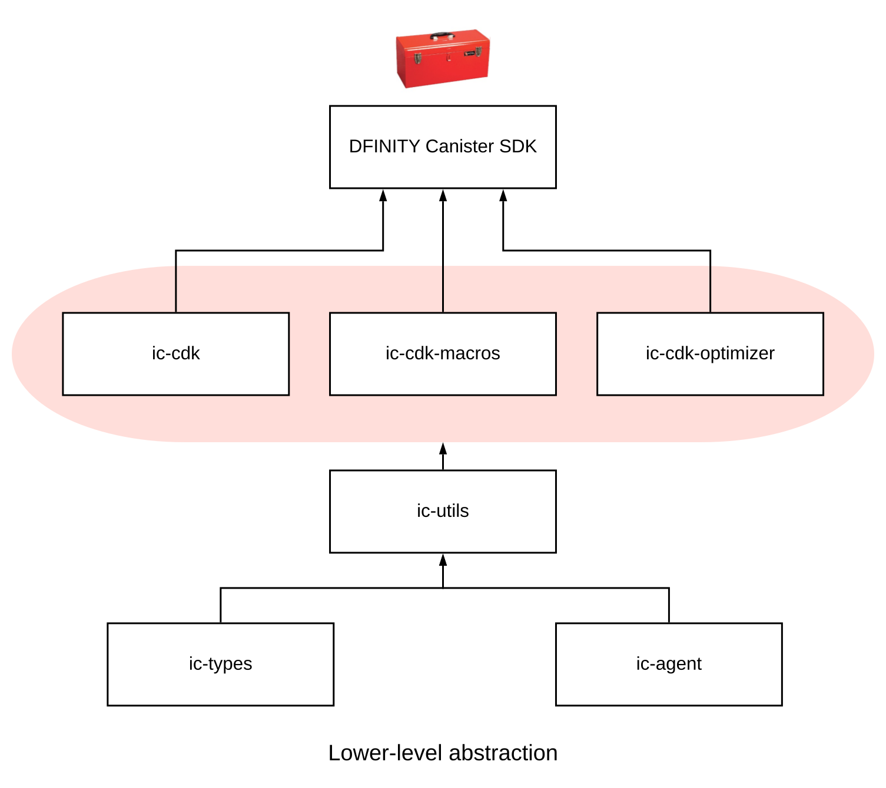

# 使用Rust的介绍

`Rust`是一种功能强大且类型合理的现代编程语言，拥有活跃的开发者社区。由于`Rust`编译为`WASM`，它为编写`dapp`以在`IC`上运行提供了丰富的开发环境。为了帮助为使用`Rust`编写可部署在`IC`上的`dapp`铺平道路，`dfinity`提供了一些工具来简化该过程。

这些工具称为`Rust`的`Dfinity Canister Development Kit (CDK)`，由以下主要的包组成：

|包|描述|
|----|----|
|`ic-types`|`ic-types`定义了用于与`IC`通信的类型，以及在构建`dapp`以及在`IC`上部署罐头时使用的类型。|
|`ic-agent`|`ic-agent`支持与`IC`直接通信。|
|`ic-utils`|`ic-utils`提供了用于管理调用和部署罐头的功能。|
|`ic-cdk`|`ic-cdk`提供了使`Rust`程序能够与`IC`的`System API`交互的核心方法。该库用作`Rust CDK`的运行时核心。|
|`ic-cdk-macros`|`ic-cdk-macros`这个库定义了有助于构建操作接口和`API`的过程宏。该库包括用于更新、查询、导入和其它重要操作的宏。|
|`ic-cdk-optimizer`|`ic-cdk-optimizer`是一个帮助库，用于减少`WASM`模块的大小。|

下图提供了`Rust Canister Development Kit (CDK)`构建快从最低到最高抽象级别的简化视图：

