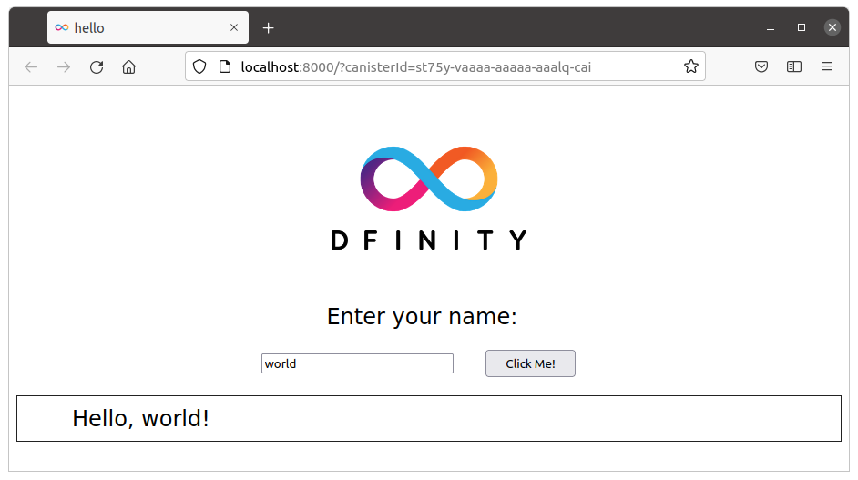

# Hello World

本节将带你创建一个非常简单的项目————由两个罐头组成：

- 一个简单的后端罐头————`hello`————实现业务代码，以及
- 一个简单的前端罐头————`hello_assets`————实现用户接口。

这个项目其实就是在`Motoko`和`Rust`快速开始手册里面那个用`dfx`创建的项目；它存放在官方实例[github仓库](https://github.com/dfinity/examples)里，并且有`Motoko`和`Rust`版本。

对于`hello`这个罐头，无论是`Motoko`实现还是`Rust`实现，它们都有相同的`Candid`接口：

``` candid
service : {
  greet: (text) -> (text);
}
```

对于前端用户界面罐头`hello_assets`，它显示一个简单的网页：



`hello_assets`是`dfx`自动生成的。