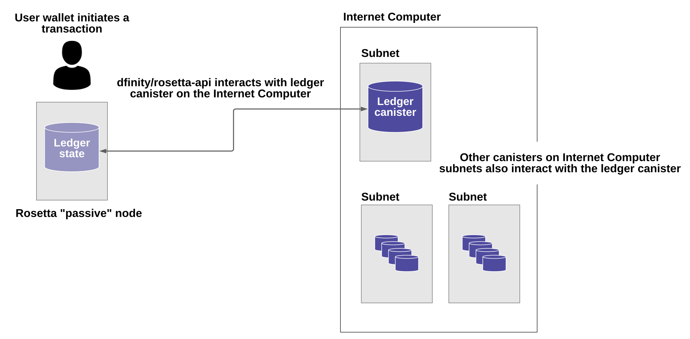

# 与`ledger`集成（Integrate with the Internet Computer ledger）

本指南介绍了用于`ICP`代币分发、交易管理、基于代币的质押和服务支付的`ICP`协议组件。该文档概述了支持`ICP`协议代币管理的设计、实施、安全保证、系统要求和应用程序编程接口（API）。

与`ledger`集成旨在为需要了解`ICP`协议代币的术语和整体交易管理流程的组织和开发者提供高级概述。

当你阅读本指南时，请注意后续文档中可能会提供有关特定组件或接口的其它详细信息，以补充本文档中提供的概述。此外，本概述重点介绍如何使用`Rosetta`接口与`IC`集成。其它集成选项也是可能的。未来的文档中可能会提供有关其它集成选项和过程的信息。

## 基本术语（Basic terminology）

-----

`IC`是一个区块链系统，由多个子网组成，用于运行去中心化应用。当你编写在`IC`上运行的去中心化应用时，你以称为罐头的概念计算单元的形式部署你的程序。罐头是一种新型的智能合约，它由程序的源代码及其运行状态组成，并在保证安全性和活性的子网上复制。

最终用户或其它罐头可以向罐头发送消息以执行特定操作。消息可以是在不修改罐头状态的情况下检索信息的查询调用（`query`），也可以是修改罐头状态的更新调用。执行更新状态的顺序是在运行罐头的子网中的所有节点之间使用共识决定的。

## `ledger`概述

-----

`ICP`协议使用称为`ledger`的罐头来专门管理`ICP`代币。在`IC`的一个特殊子网（即`NNS`子网）上，有一个单一的`ledger`罐头与其它罐头一起运行。`ledger`罐头是一个保存账本和交易的智能合约。这些交易要么为账户铸造`ICP`代币，要么将`ICP`代币从一个账户转移到另一个账户，要么烧毁`ICP`代币。`ledger`罐头维护从其创世状态（初始状态）开始的所有交易的可追溯历史记录。

### 账户（Accounts）

账户属于并由必须是`IC`委托人的账户所有者控制。两个或多个`IC`负责人不能拥有任何账户（没有“联名账户”）。

一个账户所有者可以控制多个账户。在这种情况下，每个账户对应一对（`account_owner`，`sub_account`）。子账户是一个可选的位串，有助于区分同一个所有者的不同子账户。

账本上的账户由其地址标识，该地址来源于主体`id`和子账户标识符。

在这种情况下，你可以将主体标识符视为粗略等同于比特币或以太坊的用户公钥的`hash`。你使用相应的签名对消息进行签名，从而对`ledger`罐头进行身份验证并在托管人的账户上进行操作。罐头也可以在`ledger`中拥有账户，在这种情况下，地址来自该罐头的主体（`principal`）。

`ledger`罐头使用`IC`内部的管理操作进行初始化。作为初始化过程的一部分，罐头是使用一组账户和关联的`ICP`代币余额创建的。

### 交易类型（Transaction types）

有下面三种操作可以改变`ledger`罐头的内部状态：

- 为账户铸造`ICP`代币
- 在账户之间转移`ICP`代币
- 烧毁`ICP`代币

所有操作都记录为`ledger`罐头中的交易（`transaction`）。`ledger`罐头将所有的交易记录为散列后的区块链，即运行在`ledger`罐头内的区块链，而后者又在`NNS`子网上运行。

随着状态变化被记录下来，每个新交易都被放置在一个块中并分配一个唯一的索引。整个链通过签署最新的链链接定期进行身份验证。任何有权访问`IC`的根公钥的第三方都可以验证用于验证链的签名。可以通过查询账本来检索特定的交易。

## 使用`Rosetta`接口与`ledger`罐头集成（Integrate with the Internet Computer ledger canister using the Rosetta API）

-----

可以通过多种方式与`IC`和`ledger`罐头进行交互。本文档概述了如何使用[`Rosetta`应用程序编程接口](https://www.rosetta-api.org/)与`ledger`罐头集成。这是一个有据可查的[开放标准](https://www.rosetta-api.org/docs/welcome.html)，旨在支持多种区块链数据格式和用于交换交易的结构化通信。

该接口由集成软件————`dfinity/rosetta-api`实现。该软件使你能够在`IC`之外部署一个被动`Rosetta`节点，并使用该节点与`IC`上运行的`ledger`罐头进行通信。

下图提供了`Rosetta`节点和`IC`之间使用`dfinity/rosetta-api`集成软件进行通信的简化视图：



正如该图所示，`Rosetta`节点维护`ledger`罐头的本地副本。在`Rosetta`节点上运行的`dfinity/rosetta-api`软件会定期更新其本地账本视图，方法是向账本罐头查询账本链的最新块，然后查询本链的最新块，然后查询任何丢失的块。`Rosetta`节点使用`IC`的根密钥来确保账本的本地副本是真实的。集成软件还允许你使用`Rosetta`节点将交易提交到`ledger`罐头中。

### 集成工作流程概述（Integration workflow overview）

如果你使用`Rosetta`节点与`ledger`罐头进行通信，以下总结了传输`ICP`代币的基本操作流程。在这种情况下，你必须是使用存储在钱包中的签名密钥对`IC`进行身份验证的`IC`主体。

用户向`Rosetta`节点提交交易请求后，该请求被传递给运行在该节点上的集成软件与`IC`进行交互，并完成以下操作：

1. 它从账本的本地副本中读取，以确定最新交易索引的状态和由`latest_index`标签标识的块高度
2. 它会生成一个随机的`nonce`值————用于确保交易的唯一性
3. 它为调用发送函数并指定交易金额和目的地址的`ledger`创建一个入口消息：
    ``` bash
    send(nonce, latest_index, dst, amount)
    ```
4. 它使用存储在钱包中的密钥对入口消息进行签名，以识别所有者的主体`id`
5. 它将消息转发到`IC`上的`ledger`罐头

### 设置`Rosetta`节点（Set up a Rosetta node）

你可以设置符合`Rosetta API`的节点来与`IC`并交换`ICP`代币。为了使本说明简洁，我们使用`docker`镜像来创建与`Rosetta API`的集成————也可以使用源代码构建和运行二进制文件。如果你的本地计算机还没有`docker`，请下载并安装最新版本。

设置`Rosetta`节点（连接到测试网）：

1. 安装`docker`并启动`docker`守护程序
    当你重新启动计算机时，`docker`守护程序会自动启动。如果你手动启动`docker`守护程序，则说明因本地操作系统而异。
2. 通过运行以下命令从`docker hub`中拉取最新的`dfinity/rosetta-api`镜像。
    ``` bash
    docker pull dfinity/rosetta-api
    ```
3. 通过运行以下命令启动集成软件：
    ``` bash
    docker run --interactive --tty --publish 8080:8080 --rm dfinity/rosetta-api
    ```
    此命令在本地主机上启动软件并显示类似于以下内容的输出：
    ``` text
    Listening on 0.0.0.0:8080
    Starting Rosetta API server
    ```
    默认情况下，该软件不连接到`IC`主网上的`ledger`罐头，而是连接到测试网。如果你已经分配了测试网络和相应的`ledger`罐头标识符，则可以通过指定附件容器参数来针对该网络运行命令。例如，以下命令说明了通过将容器参数设置为`2xh5f-viaaa-aaaab-aae3q-cai`来连接到测试网上的`ledger`罐头。
    ``` bash
    docker run \
        --interactive \
        --tty \
        --publish 8080:8080 \
        --rm \
        dfinity/rosetta-api
        --canister 2xh5f-viaaa-aaaab-aae3q-cai
    ```
    > 注意，第一次运行命令时，节点可能需要一些时间才能赶上链的当前链接。当节点被追上时，你应该会看到类似以下内容输出：
    ``` text
    You are all caught up to block height 109
    ```
    完成此步骤后，节点继续作为不参与出块的被动节点运行。
4. 打开一个新的终端窗口或选项卡并运行`ps`命令以验证服务的运行状态。
    如果你需要停止服务，请按`control-c`。例如，你可能希望这样做以更改正在使用的罐头的标识符。
    要在设置节点后测试集成，你需要编写一个程序来模拟委托人提交交易或查找账户余额。

### 在生产环境中运行`Rosetta`节点（Run the Rosetta node in production）

完成测试后，你应该在生产模式下运行`docker`镜像，不带`--interactive`、`--tty`、`--rm`命令行选项。这些命令行选项用于附加交互式终端会话和删除容器，主要用于测试目的。

要在生产环境中运行该软件，你可以使用`--detach`选项启动`docker`镜像以在后台运行容器，并且可以选择指定`--volume`命令来存储块。

要将`Rosetta`节点实例连接到主网，请添加标志`--mainnet`和`--not-whitelisted`。

有关`docker`命令行选项的更多信息，请参阅[`docker`参考文档](For more information about Docker command-line options, see the Docker reference documentation.)。

### 要求和限制（Requirements and limitations）

`docker`镜像中提供的集成软件有一项要求，该要求不属于标准`Rosetta API`规范的一部分。

对于涉及`ICP`代币的交易，必须在网络收到签名交易前`24`小时内创建未签名交易。原因是每个事务的`created_at`字段引用了一个现有的事务（本质上是创建事务时本地可用的`last_index`）。任何提交的交易涉及太旧的交易都会被拒绝以维持运营效率。

除此要求外，`Rosetta API`集成软件与所有标准`Rosetta`端点完全兼容，并通过了所有`rosetta-cli`测试。该软件可以接接受任何有效的`Rosetta`请求。但是，集成软件仅提示使用`Ed25519`对交易进行签名，而不是此处列出的所有签名方案，并且仅回复规范支持的一小部分潜在响应。例如，该软件没有实现`Rosetta`的任何`UTXO`功能，因此你不会在任何软件响应中看到任何`UTXO`消息。

### `ICP`工具代币的基本属性（Basic properties for ICP utility tokens）


