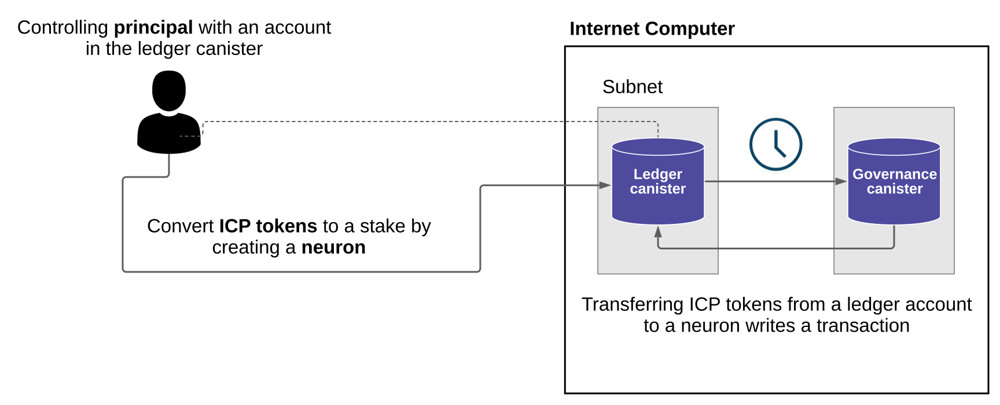

# 去中心化应用`NNS`快速入门（Network nervous system dapp quick start）

所有对`IC`的配置和行为的更改都由称为`NNS`的算法控制系统控制。`NNS`控制`IC`区块链的所有方面，并负责执行许多网络管理操作。例如，`NNS`负责：

- 升级节点使用的协议和客户机操作系统软件。
- 将新的节点和机器引入`IC`网络。
- 创建新的子网以增加网络容量。
- 拆分子网以平衡网络负载。
- 配置控制用户必须为计算能力支付多少费用的参数。
- 监视罐头活动和节点性能，以查找恶意行为和统计偏差。
- 停用恶意软件或性能不佳的节点以保护网络。

对网络进行更改和更新的请求以提案的形式提交给`NNS`。`NNS`决定根据神经元持有者的投票活动采用或拒绝提案。

## 什么是神经元？（What are neurons?）

------

为了使网络参与者能够对提案进行投票，他们需要在给定的时间段内锁定`ICP`代币，以创建称为神经元的代表。

由于神经元表示`ICP`代币的权益，因此它们还表示具有`ledger`罐头账户和控制`ledger`账户的主体的`id`。

神经元通过确保它们所代表的`ICP`代币不能在称为锁定期的特定时间内流动，从而提供`IC`负责任治理所需的稳定性。



### 治理和投票的回报（Governance and voting rewards）

当个人或组织将`ICP`代币锁定在神经元中时，神经元持有者可以就治理问题提出建议和投票。为了鼓励参与，神经元持有者还将获得投票奖励，其投票比例与他们锁定的`ICP`代币数量以及最多`8`年的锁定期长度成比例。

### 从神经元中解锁`ICP`代币（Unlocking the stake held by a neuron）

网络参与者创建神经元后，被质押的`ICP`代币只能通过完全溶解神经元来解锁。在其锁定状态下，神经元具有固定的非零溶解延迟，相当于锁定期。例如，假设你有`100`个`ICP`代币被锁定了`5`年。在成功创建神经元后，你的溶解延迟为`5`年。

当溶解计时器到达零时，神经元所有者（创建神经元的`ICP`代币的持有者）可以溶解神经元并解锁`ICP`代币。

溶解的神经元不复存在，并且所表示的`ICP`代币被释放到相应的`ledger`账户中。

## 连接到`IC`（Connect to the Internet Computer）

------

要使用`NNS`去中心化应用连接到`IC`：

1. 打开浏览器并导航到[`NNS`](https://nns.ic0.app/)。
2. 单击登录以使用[`II`](https://identity.ic0.app/)连接。
    如果你之前没有注册过，可以单击`Register with Internet Identity`进行注册。
    > 注意，我们强烈建议你将多个设备和身份验证方法添加到你的`II`中。例如，使用安全密钥注册多个物理设备（如计算机和手机），并使用这些设备及其上运行的浏览器支持的身份验证选项。
    有关创建`II`的详细信息，请参阅[如何使用`II`](https://smartcontracts.org/docs/ic-identity-guide/auth-how-to.html)。
    注册后，你可以单击登录以使用已注册的`anchor`和身份验证方法（例如，安全密钥或指纹）进行身份验证。
3. 单击`Proceed`以继续访问`NNS`。

## 添加一个账户（Add an account）

-----

使用`II`登录会在`ledger`罐头中为你创建一个主账户。如果你的`ICP`代币与你的开发者身份相关联；即由`dfx`命令行工具创建的身份。你的主账户显示`0.00`表示你的`ICP`代币余额。例如：


在转移任何代币之前，你可以创建一个或多个关联子账户或将硬件钱包附加到你的账户。

添加用于管理`ICP`代币的账户：

1. 打开浏览器并导航到[`NNS`](https://nns.ic0.app/)。
2. 单击`Login`按钮以使用你的`II`身份进行登录。
3. 验证你的`id`号码，然后单击`Login`以使用你注册的设备和身份验证方法进行身份验证。
4. 单击`Proceed`以访问`NNS`。
5. 在默认`ICP`选项卡上，单击`Add Account`。
6. 选择待添加的账号类型。
    - 新链接账户创建一个新的子账户链接到你在`ledger`罐头中的主账户地址。
    - 附加硬件钱包将硬件钱包添加到`ledger`罐头中的主账户地址。
7. 单击`New Linked Account`新建链接账户，输入账户名称，然后单击`Create`创建。
    

## 在账户之间转移`ICP`代币（Transfer ICP utility tokens between accounts）

------

如果你选择自行保管持有你的`ICP`代币，并且代币与你的开发者身份相关联，而不是你注册的`II`，你需要将`ICP`代币转移到你的账户才能使用`NNS`。

要转移由你开发者身份控制的`ICP`代币：

1. 在本地计算机上打开终端。
2. 通过运行以下命令，检查你是否使用了可以控制`ledger`的身份：
    ``` bash
    dfx identity whoami
    ```
    在大多数情况下，你应该看到你当前正在使用你的默认开发者身份。例如：
    ``` text
    default
    ```
3. 通过运行以下命令查看当前身份的主体的文本表示：
    ``` bash
    dfx identity get-principal
    ```
    此命令显示类似于以下内容的输出：
    ``` text
    tsqwz-udeik-5migd-ehrev-pvoqv-szx2g-akh5s-fkyqc-zy6q7-snav6-uqe
    ```
4. 通过运行以下命令检查与你的身份关联的`ledger`账户中的当前余额：
    ``` bash
    dfx ledger --network ic balance
    ```
5. 通过运行类似于以下命令将`ICP`代币转移到你的主账户或你创建的链接子账户：
    ``` bash
    dfx ledger --network ic transfer <destination-account-id> --icp <ICP-amount> --memo <numeric-memo>
    ```
    例如，假设你有以下账户：
    
    如果你想将一个`ICP`代币转移到主账户，你可以运行以下命令：
    ``` bash
    dfx ledger --network ic transfer dd81336dbfef5c5870e84b48405c7b229c07ad999fdcacb85b9b9850bd60766f --memo 12345 --icp 1
    ```
    如果你还想将一个`ICP`代币转移到`pubs`账户，你可以运行以下命令：
    ``` bash
    dfx ledger --network ic transfer 183a04888eb20e73766f082bae01587830bd3cd912544f63fda515e9d77a96dc --icp 1 --memo 12346
    ```
    此示例说明如何通过`--icp`命令行选项将`ICP`代币转换为使用整数。
    - 你还可以使用`--e8s`选项单独或与`--icp`选项一起指定`ICP`代币的小数单位（称为`e8s`）。
    - 或者，你可以使用`--amount`选项指定要传输的`ICP`代币的数量，小数单位最多为小数点后`8`位，例如`5.00000025`。
    目标地址可以是在`ledger`罐头中的地址、你使用的`NNS`添加的账户、你在交易所的钱包地址。
    如果你将`ICP`代币转移到`NNS`的账户中，你可能需要刷新浏览器才能看到反映的交易。
    有关使用`dfx ledger`命令行选项的更多信息，请参阅[`dfx ledger`](https://smartcontracts.org/docs/developers-guide/cli-reference/dfx-ledger.html)。

## 质押`ICP`代币到神经元（Stake ICP utility tokens in a neuron）

-----

将`ICP`代币转移到`NNS`后，你可以使用`NNS`创建和管理神经元，对提案进行投票，并在`IC`上创建罐头。

神经元需要参与治理并获得奖励。要创建神经元，你必须锁定一定数量的`ICPp`代币一段时间。创建一个神经元所需的最低股份是一个`ICP`代币。你可以设置质押的锁定时间，从六个月到八年。

质押`ICP`代币：

1. 打开浏览器并导航到`NNS`。
2. 单击`Login`并使用你的`II`进行链接。
3. 验证你的`id`号码，然后单击`Login`以使用你注册的设备和身份验证方法进行身份验证。
4. 单击`Proceed`以访问`NNS`。
5. 单击`Neurons`，然后单击`Stake Neurons`质押神经元.
6. 输入要质押的`ICP`代币的数量，然后单击`Create`创建。
7. 设置神经元溶解延迟以控制锁定的时间长度，然后单击更新延迟。
    例如：
    
8. 单击`Yes`，我确定确认锁定期，然后关闭窗口以查看新创建的神经元属性。
    

### 创建神经元之后你能做什么（What you can do after creating a neuron）

质押并创建神经元后，你可以：

- 通过单击开始解锁并启动溶解延迟计时器。
- 通过单击增加溶解延迟来增加溶解延迟时间。
- 通过单击锁定开始解锁倒计时后停止溶解延迟。
- 增加你质押的`ICP`代币数量。

### 开始和停止溶解延迟（Starting and stopping the dissolve delay）

创建新神经元不会自动启动溶解延迟计时器。你必须通过单击开始溶解明确地开始计时器倒计时。

例如，如果你将溶解延迟设置为一年并希望立刻开始倒计时，则应在创建神经元的过程中单击“开始解锁”。如果你改变主意并想要停止当前正在进行的倒计时，你可以单击“锁定”，单击“锁定”停止溶解延迟后，你可以单击“开始解锁”恢复倒计时，而无需更改现有的溶解延迟时间。如果你想继续正在进行的倒计时但延长锁定时间，你可以单击增加溶解延迟，然后选择更长的溶解延迟。

### 添加`ICP`到现有的神经元（Adding ICP utility tokens to an existing neuron）

创建神经元后，你可以增加你在该神经元中质押的`ICP`代币数量，以增加你的投票权和奖励。例如，如果你最初持有少量`ICP`代币，然后决定购买额外的代币，你可以选择创建新的神经元或“充值”现有的神经元。

要增加现有神经元的权益：

1. 按照在神经元中质押`ICP`代币的步骤，使用`NNS`质押原始神经元。
2. 在`ICA`交易仪表板中查找交易以获得神经元地址。
    你可以使用你的`ledger`账户标识符来搜索你的交易。
3. 返回到`NNS`，然后单击新建事务。
4. 将交易仪表板中的神经元地址粘贴到目标地址字段中，然后单击`Continue`继续。
5. 输入要添加到指定神经元的`ICP`代币数量，然后单击`Continue`继续。
6. 验证交易详情，然后点击`Verify and Send`确认并发送。
    
7. 验证已完成的交易，然后单击`Close`关闭。
8. 点击`Neurons`神经元选项卡查看新增的质押。

## 配置神经元跟随规则（Configure following rules）

------

积极参与治理是`IC`长期健康发展的重要因素。对提案进行投票也是你将`ICP`代币锁定在神经元中而获得奖励的一个重要因素。

然而，直接对提交给`NNS`的每个提案进行投票会带来一些挑战。例如，当你不在时，可能会提交提案并要求投票，或者提出你缺乏评估专业知识的更改。为了应对这些挑战，你可以将神经元配置为跟随一组神经元的投票来自动投票以采纳或拒绝提案。

为了最大化你的奖励，你应该通过关注与你的利益一致的活跃神经元持有者，对尽可能多的提案进行投票。例如，你可能会关注`ICA`的某些主题（例如子网管理）和其它神经元持有者的主题（例如治理）。

要配置你跟随其它神经元持有者的方式：

1. 打开一个浏览器并导航到`NNS`。
2. 点击`Login`使用`II`登录.
3. 验证你的`id`号码，然后单击`Login`以使用你注册的设备和身份验证方法进行身份验证。
4. 点击`Proceed`回到`NNS`。
5. 点击`Neurons`神经元选项卡，然后单击特定神经元标识符的链接以显示其属性。
6. 点击`Edit Followees`编辑关注者。
7. 选择一个提案主题。  
    例如，展开`Governanace`主题，然后单击`Enter Followee`。
8. 选择要跟随的神经元持有者，然后单击`Follow`跟随。
    例如，跟随`ICA`：
    
    神经元持有者已添加到你当前关注的列表中。
9. 对你希望神经元的投票自动跟随一个或多个其它神经元持有者的投票的每个主题重复此操作。

## 将溶解的神经元存入账户（Disburse dissolved neurons into an account）

-----

当神经元的溶解延迟计时器达到零时，你可以支付神经元的股份并将其锁定的`ICP`代币余额转移到你指定的`ledger`账户中。执行此步骤后，神经元标识符及其`ledger`账户历史将从治理罐头中永久删除。

要分配一个神经元并返回其`ICP`代币：

1. 打开浏览器并导航到`NNS`。
2. 单击`Login`以使用你的`II`进行登录。
3. 验证你的`id`号码，然后单击`Login`以使用你注册的设备和身份验证方法进行身份验证。
4. 单击`Proceed`回到`NNS`。
5. 单击`Neurons`神经元选项卡，然后单击已达到其溶解延迟期结束的解锁神经元。
    例如：
    
6. 点击`Disburse`。
    例如：
    
7. 输入地址或选择账户以接收`ICP`代币。
    例如，你可以选择`dev-projects`关联账户。
8. 确认转账信息，然后点击`Confirm and Send`发送。
    例如，检查目标地址是否与`dev-projects`关联账户的预期地址匹配：
    
9. 确认整个交易，然后点击`Close`关闭。
    例如：
    
    如果你将`ICP`代币转移到`ledger`罐头中的一个账户，你可以单击`ICP`选项卡并查看反映的新余额。例如：
    

## 产生新的神经元（Spawn new neurons）

-----

当你对提案进行投票时————直接或跟随其它神经元的投票————与你的神经元相关的成熟度增加，这反过来又增加了你参与治理所获得的回报。当锁定权益的成熟度达到一个`ICP`的最小阈值时，你可以生成一个新的神经元。`spawn`操作创建了一个新的神经元，该神经元将新的`ICP`余额锁定在账本上。

例如，如果你有一个包含`100`个`ICP`代币的神经元，并且它的成熟度是`10%`，你可以生成一个包含大约`10`个新`ICP`代币的新神经元。对于具有`100`个代币的神经元要达到生成的最低阈值，其成熟度需要大于`1%`。

从现有的神经元生成新神经元后，现有神经元的成熟度降至零。

从现有神经元生成新神经元：

1. 打开浏览器并导航至`NNS`。
2. 单击`Login`使用`II`登录。
3. 验证你的`id`号码，然后单击`Login`以使用你注册的设备和身份验证方法进行验证。
4. 单击`Proceed`回到`NNS`。
5. 单击`neurons`神经元选项卡，然后单击已达到产生新神经元所需的最低成熟度的神经元。
6. 点击`Spwan Neuron`。
    请记住，新生成的神经元的溶解延迟为`1`天，你可以选择通过解锁`ICP`代币或增加溶解延迟来收集额外的奖励。
    有关成熟度和产生新神经元的更多信息，请参阅以下文章：
    - [通过质押`ICP`代币获得可观的投票奖励](https://medium.com/dfinity/earn-substantial-voting-rewards-by-staking-in-the-network-nervous-system-7eb5cf988182)。
    - [了解`IC`的`NNS`、神经元、`ICP`代币](https://medium.com/dfinity/understanding-the-internet-computers-network-nervous-system-neurons-and-icp-utility-tokens-730dab65cae8)。
    - [`NNS`和钱包入门手册](https://medium.com/dfinity/getting-started-on-the-internet-computers-network-nervous-system-app-wallet-61ecf111ea11)。

## 对提案投票（Vote on proposals）

------

你可以使用`NNS`中的过滤器选择你看到和投票的提案类型和提案主题————直接或跟随其它神经元利益相关者。例如，如果你想对所有涉及网路参与者（例如数据中心身份和节点运营商）的提案进行审核和投票，但对查看与国际货币基金组织衡量的`ICP`当前市场价值相关的提案不感兴趣，你可以用过滤器把它们过滤出去。

## 提交一个提案（Submit a proposal）

-----

## 用燃料部署一个罐头（Deploy a canister with cycles）

-----


    