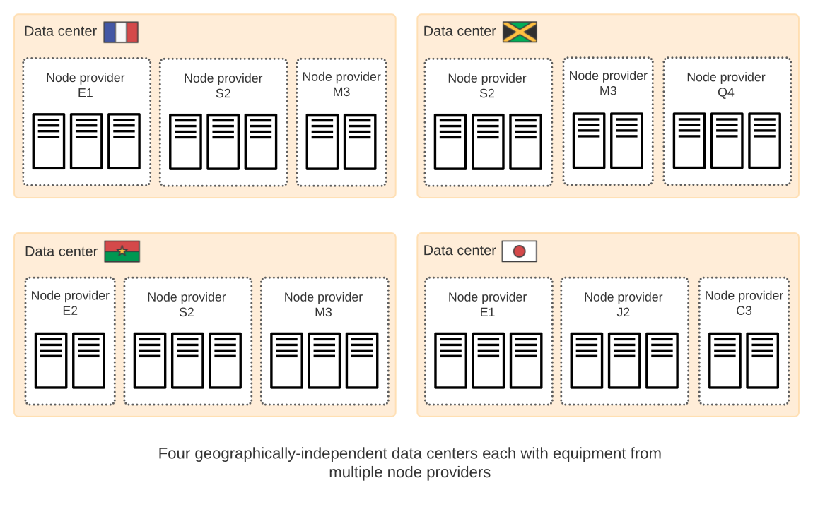

# 去中心化的数据中心

`IC`不是存在于某个地方的物理设备，相反，`IC`是由存在世界各地的、独立的数据数据中心组成的。

不像传统的公有云或者私有云，`IC`并不属于某家企业。相反，`IC`是一种公共设施，其更新和操作通过协议中定义的算法、去中心化治理系统进行管理。它的架构使多台计算机能够像一个非常强大的虚拟机一样运行。

位于全球各地的、组成`IC`的节点被组织成一个个子网，这些子网又使用`Chain Key`加密技术互相连接。这个分布式的架构无需防火墙或其它易受攻击的技术即可实现安全通信。独立的节点运营商向数据中心支付费用以托管他们的节点并获得报酬，以贡献计算能力和托管服务以支持在`IC`上运行的去中心化应用。

## 子网和数据中心

----

为了提供能够承受潜在服务中断的真正分散的区块链，构成任何给定子网的物理节点分布在不同位置的数据中心。节点本身可能由不同方合作伙伴关系拥有或提供，或者与它们运营所在的数据中心位置无关。

下图提供了在四个数据中心具有节点的子网的简化视图：

在这个简化的场景中：

- 有四个地理独立的数据中心
- 每个数据中心都有由多个节点提供商提供的硬件
- 任何单个节点提供商都可能在多个数据中心拥有设备

尽管此示例表示一个子网，其节点位于多个数据中心，但如果需要，任何节点都可以移出该子网以形成新的子网。网络拓扑的更改通过称为网络神经系统（`NNS`）的`IC`治理系统进行管理。

## 节点提供商和数据中心运营商（Node providers and data center operators）

在大多数情况下，节点提供商（或与他们合作的数据中心运营商）负责监控和维护运行`IC`的设备的计算能力。例如，如果出现硬件故障或者系统性能不佳，节点提供商或者数据中心运营商可能需要维修或更换设备。然而，网络运营和升级是通过分散的治理系统网络神经系统（`NNS`）进行监控和管理的。

## 想了解更多？

-----

如果你想了解更过与数据中心运营商和节点提供商的信息，请查看以下相关资源：

[节点提供商的帮助中心](https://support.internetcomputer.org/hc/en-us/sections/4405489337748-Node-Provider)