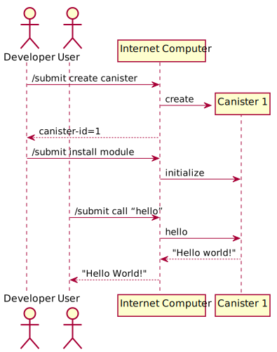
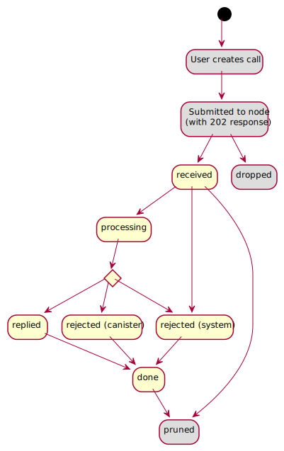

# `Internet Computer`接口手册（The Internet Computer Interface Specification）

## 介绍（Introduction）

-----

欢迎来到`Internet Computer`！我们之所以称`Internet Computer`为`Internet Computer`，是因为事实上`Internet Computer`是由无数的实实在在的物理计算机组成的区块链。阅读本节后，你将会看到一个开放的、世界范围内可用的计算机。如果仅仅是开发人员想在`Internet Computer`上开发去中心化的应用或者一般用户想使用`Internet Computer`上的去中心化应用，那可能只需要了解一点点`ICP`协议就行了（`Internet Computer Protocol`）。不过，感兴趣的开发者或任何人，都能一览`Internet Computer`的整个架构的任何细节特性

### 目标用户（Target audience）

本文档将从底层讲解`Internet Computer`的接口以及如何使用这些接口。

> 注意，本节涉及的仅仅是底层接口，可能不适合应用层开发者或者一般的终端用户，想了解`SDK`，`Motoko`可以[点击这里](https://sdk.dfinity.org/)。

目标观众：

- 使用底层接口的开发者（例如需要开发`agent`，`canister developments kits`，模拟器和其它基础工具）。
- 实现底层接口的开发者（例如`Internet Computer`的开发者）。
- 希望完全了解`Internet Computer`的人（例如对`Internet Computer`做安全分析）。

> 注意，本文档是严格的、技术性的文档，它不是`Internet Computer`的介绍文档，如果有需要，请先阅读`Internet Computer`的高级文档。

### 本文档的范围（Scope of this document）

如果你能够将`Internet Computer`视做一个执行`WebAssembly`的分布式引擎，那本文档就是讲述如何运行这些`Webassembly`的。为了文档的可扩展性，本节不会涉及共识协议、节点、子网、正交一致性和治理。

本文档尝试达到与实现无关：它能帮助你实现一个与`Internet Computer Protocol`兼容的新的`Internet Computer`。这意味着本文档不包含与运行`Internet Computer`相关的接口（例如数据中心运营商、协议开发者、治理用户），因为节点的更新、监控、日志记录等话题与实际实施及其架构有着内在的紧要联系。

### `Internet Computer`的整体架构（Overview of the Internet Computer）

`Internet Computer`（缩写为`IC`）上的去中心化应用`Dapp`，是通过罐头智能合约（`canister smart contracts`，缩写为`canister`，又叫罐头）实现的。如果你想在`IC`上部署一个智能合约，首先需要创建一个包含`WebAssembly`代码和配置文件的罐头`canister`，然后通过[Http 接口](https://smartcontracts.org/docs/interface-spec/index.html#http-interface)将它部署到`IC`网络上。最方便的方式就是通过`Motoko`语言开发`canister`然后通过`dfx`直接部署到`IC`；当然你也能够制作并使用自己的工具来开发和部署`canister`，[canister模块是怎样的](https://smartcontracts.org/docs/interface-spec/index.html#canister-module-format)和[为什么WebAssembly代码能和IC交互](https://smartcontracts.org/docs/interface-spec/index.html#system-api)这两节讲述了如何做。

一旦你的`canister`成功部署到`IC`主网，那它就是一个智能合约了。其它想用它的用户，能通过[Http接口](https://smartcontracts.org/docs/interface-spec/index.html#http-interface)按照[System API](https://smartcontracts.org/docs/interface-spec/index.html#system-api)里面指定的方式与这个`canister`交互。

用户能过通过`Http`接口进行一种称作`query`的查询调用，这种调用非常快速，不能它不能改变`canister`的内部状态。



### 命名法（Nomenclature）

为了达成一致，我们定义一下词汇：

我们避免使用`client`，因为`client`既可以是使用`Internet Computer`的`client`，也可以是组成`Internet Computer`的`client`，所以我们使用`user`来表示使用`Internet Computer`的外部用户，并且在许多情况下（一些代码中）它被叫做`agent`来帮助用户与`IC`交互。

罐头的公共入口称作`method`，`method`有两种类型。一是`update`类型的`method`，它能改变`canister`的内部状态；二是`query`类型的`method`，它不能改变`canister`的内部状态，并且没有远程调用。

`method`是由`caller`到`callee`被调用的，通常产生一个包含`reply`或者`reject`的`response`。`method`可以包含参数。

外部的`caller`可以发起一个`update`调用，`update`调用可以可以调用`update`或`query`类型的`method`；而如果外部`caller`发起的是`query`调用，那就只能调用`query`类型的`method`。罐头内的调用可以调用两种类型的`method`。记住，从罐头`A`到罐头`B`的调用也是罐头`B`的内部调用。

在内部，一个调用`call`或者`response`被视作从发送者`sender`到接收者`receiver`的消息。消息是没有回复的。

`WebAssembly`函数是由`WebAssembly`模块或者`System API`提供的。这些函数的调用可能被捕获（发生错误）也可能返回（能够带有返回值）。函数能够接收参数。

外部`user`通过`Http`接口提交请求到`IC`。请求可能被接受也可能被拒绝，一些请求也可能创建内部消息。

`canister`和`user`都被`principal`标识区分，有时候又叫做`id`。

## 共同的概念（Pervasive concepts）

-----

在详细介绍四大部分接口之前（即`agent`使用的[Http接口](https://smartcontracts.org/docs/interface-spec/index.html#http-interface)，`canister`使用的[System API](https://smartcontracts.org/docs/interface-spec/index.html#system-api)、[virtual Management canister](https://smartcontracts.org/docs/interface-spec/index.html#ic-management-canister)、[System State Tree](https://smartcontracts.org/docs/interface-spec/index.html#state-tree)），本节讲述这些接口之前的相同部分。

### 缺省常量和限制（Unspecified constants and limits）

本规范可能会应用某些常量和限制，但尚未指定它们的具体值，即使它们的实现是已经定义好的。许多资源的限制仅与指定`IC`的错误处理行为相关（如上所述，本文档中还没有准确描述）。此列表还不完整：

- `MAX_CYCLES_PER_MESSAGE`：在`canister`执行某条消息之前，`canister`内必须具有的最小的`Cycles`，在消息执行之前从`canister`余额扣除。详情查看[Message执行](https://smartcontracts.org/docs/interface-spec/index.html#rule-message-execution)。
- `MAX_CYCLES_PER_RESPONSE`：在`canister`执行调用时，预留出来的最小`Cycles`，在调用执行之后从`canister`余额扣除，用于处理`response`，多余的`Cycles`会退还。详情查看[Message执行](https://smartcontracts.org/docs/interface-spec/index.html#rule-message-execution)。
- `MAX_CANISTER_BALANCE`：一个`canister`最大的`Cycles`余额，大于2^128的值会被丢弃。

### 主体（Principals）

`principal`是`canister`、`user`和其它未来可能的概念的通用标识符。就`IC`的大多数用途而言，`principal`是长度从`0`到`29`字节的不透明的二进制`blob`，没有什么特别的机制区分`canister`和`user`的`principal`。

然而，这些`principal`有一些结构来编码特定的身份验证和授权行为。

####  特殊形式的主题（Special forms of Principals）

在本段，`H`表示`SHA-224`，`·`表示二进制连接符，`|p|`表示`p`的字节长度。

`identity`可以分为下面几类：

1. 不透明`identity`：
    由`IC`自动生成。
    > 注意，通常情况下这类`identity`有`0x01`结尾，不过一般用户不用理会这类`identity`。
2. 自认证的`identity`：
    格式：`H(public_key) · 0x02`（一共29个字节）。
3. 派生`identity`：
    格式：`H(|registering_pricipal| · registering_pricipal · derivation_nonce) · 0x03`（一共29字节）。
    当需要注册一个`identity`时，这些`identity`就会被特殊处理。无论谁注册一个`identity`都需要提供一个`derivation_nonce`，用这个`derivation_nonce`和注册者的`identity`一起`hash`，这样，每个用户就都有一个属于自己的`identity`空间。
    > 注意，派生`identity`目前暂时未在本文档中明确使用，但它们可能会在内部或将来使用。
4. 匿名`identity`：
    以`0x04`结尾，用作匿名调用者的`identity`，用类`identity`能够免除签名来调用`IC`接口。
    当`IC`创建一个新的`identity`（`fresh identity`）时，它永远不会创建一个自我验证的`identity`、一个匿名的`identity`或一个从罐头或用户派生的`identity`。

#### 主题的文本表示（Textual representation of principals）

> 注意，`IC`接口实际上不是用文本表示的`pricipal`（总是用二进制格式的`principal`）

现在，我们规定一个标准的、文本表示的`principal`————在任何需要的时候使用，比如打印`principal`到终端、显示到网页给用户、输出到日志文件、或者是用在代码中等等。

对于二进制流`b`，它的文本表示是`Grouped(Base32(CRC32(b) · b))`：
- `CRC32`：四字节的纠错码，`ISO 3309`和`ITU-T V.42`标准，详情查看[这里](https://www.w3.org/TR/2003/REC-PNG-20031110/#5CRC-algorithm)
- `Base32`：一种编码方式，[RFC4648](https://tools.ietf.org/html/rfc4648#section-6)标准。
- `Grouped`：一个函数，接收`ASCII`字符串，并且每隔5个字符插入一个`-`但是首尾永远不会有`-`分隔符。

`principal`应该总是用小写字母的形式，但解析的时候不应该是大小写敏感的。

因为`principal`的最大长度是`29`字节，所以`principal`的文本表示最大不超过`63`个字节（`10*5+3` + `10`个分隔符）。

> 注意，一个`identity`为`0xABCD01`的罐头的校验码为`0x233FF206`（[在线计算器](https://crccalc.com/?crc=ABCD01&method=crc32&datatype=hex&outtype=hex)），所以最终文本格式的`identity`应该是`em77e-bvlzu-aq`。

编码和解码`principal`的实例代码（可以直接复制到`bash`执行）：

编码`principal`：

``` bash
function textual_encode() {
  ( echo "$1" | xxd -r -p | /usr/bin/crc32 /dev/stdin; echo -n "$1" ) |
  xxd -r -p | base32 | tr A-Z a-z |
  tr -d = | fold -w5 | paste -sd'-' -
}
```

解码`principal`：

``` bash
function textual_decode() {
  echo -n "$1" | tr -d - | tr a-z A-Z |
  fold -w 8 | xargs -n1 printf '%-8s' | tr ' ' = |
  base32 -d | xxd -p | tr -d '\n' | cut -b9- | tr a-z A-Z
}
```

### 罐头的生命周期（Canister lifecycle）

`IC`上的去中心化应用又叫做罐头`canister`。概念上来说，一个罐头有下面几种状态：

- 罐头`identity`（是一个`principal`）
- 罐头的控制着`controller`（一个可为空的`principal`数组）
- `Cycles`余额
- 罐头的运行状态，可以是`running`、`stopping`、`stopped`
- 保留资源

一个罐头可以是空的（刚创建的时候），也可以是非空的，一个非空的罐头还有如下状态：

- 以罐头格式组织的代码
- 数据（内存，全局变量等）
- 可能还有一些其它的数据用来实现`IC`（例如队列）

可以通过[安装代码](https://smartcontracts.org/docs/interface-spec/index.html#ic-install_code)使罐头变成未空的状态，已安装代码的罐头也可以卸载代码。

如果一个空的罐头收到响应时，该响应会被丢弃，就好像罐头在处理响应时被捕获一样。

#### 罐头的燃料（Canister cycles）

`IC`区块链依赖`Cycles`管理它的资源。罐头使用`Cycles`来为它使用的资源付费。

当一个罐头的`Cycles`被消耗到零时，它的状态会变为`deallocated`，这个下面两种情况是一样的效果：

- 卸载这个罐头中的代码（IC method [uninstall_code](https://smartcontracts.org/docs/interface-spec/index.html#ic-uninstall_code)）
- 设置该罐头的所有资源保留为零

在这之后，罐头就是空的。充值之后就能重新安装。

> 注意，一旦某个罐头被清空，它的`identity`、`Cycles`余额、控制者（`controller`）`identity`会被保留在`IC`长达十年，至于十年后会发生什么，我们还没决定好。

#### 罐头的状态（Canister state）

罐头的状态能够用来控制罐头是否去处理进来的请求：

- `running`：正常处理进来的请求
- `stopping`：进来的请求会被`IC`拒绝，但是正在返回的请求正常返回
- `stopped`：进来的请求会被`IC`拒绝，并且此时`canister`没有正在返回的请求

特殊情况：不管[管理员罐头](https://smartcontracts.org/docs/interface-spec/index.html#ic-management-canister)是什么状态，对它的请求都会被处理。

可以在`stop_canister`函数和`start_canister`函数期间初始化罐头的操作者`controller`（查询罐头状态使用`canister_status`函数，罐头自己也能调用这个函数查询罐头的状态）。

注意：此状态与罐头是否为空的问题正交：空罐头可以处于运行状态。但是调用一个空罐头还是会响应一个`reject`。

### 签名（Signatures）

数字签名方案用于验证`IC`基础设施各个部分中的消息。签名是域分隔的（`domain separated`），这意味着每条消息都以一个字节字符串为前缀，该字节字符串对于签名的目的是唯一的。

`IC`支持多种签名方案，下面的章节会详细给出。对于每一种方案，我们都指定在公钥中编码的数据（始终是`DER`编码，并指示要使用的方案）以及签名的形式（对于本规范的其余部分而言，它们是不透明的`blob`）。

在所有情况下，签名的有效负载都是域分割符和消息的串联。本规范中对签名的所有使用都表示域分隔符，以唯一表示签名的目的。域分隔符在构造上是无前缀的，因为它们的第一个字节表示它们的长度。

#### Ed25519 和椭圆曲线签名（Ed25519 and ECDSA signatures）

本方案支持普通的签名：

- [`Ed25519`](https://ed25519.cr.yp.to/index.html)或者
- `P-256`曲线上的[`ECDSA`](https://nvlpubs.nist.gov/nistpubs/FIPS/NIST.FIPS.186-4.pdf)（也叫做`secp256r1`），使用`SHA-256`作为`hash`函数
- 公钥必须对签名方案`Ed25519`或`ECDSA`有效，并且被编码为`DER`
  - 查看[RFC 8410](https://tools.ietf.org/html/rfc8410)了解如果对`Ed25519`公钥进行`DER`编码
  - 查看[RFC 5480](https://tools.ietf.org/rfc/rfc5480)了解如何对`ECDSA`公钥进行`DER`编码；对于曲线`secp256k1`，使用`OID 1.3.132.0.10`，这些点必须以未压缩的格式指定（即`0x04`后跟`x`和`y`的大端`32`字节编码）。
- 签名是以`32`字节大端编码的`r`、`s`连接组成的。

### Web Authentication

`web authentication`允许的签名方案是：

- `P-256`曲线上的`ECDSA`，使用`SHA-256`作为`hash`函数
- [RSA PKCS#1v1.5 (RSASSA-PKCS1-v1_5)](https://datatracker.ietf.org/doc/html/rfc8017#section-8.2)，同样使用`SHA-256`作为`hash`函数

签名是通过使用有效负载作为`web authentication`断言中的挑战来做的。

通过验证挑战字段是否包含有效负载的`basg64url`编码来检查签名，并且该签名在`authenticationatorData · SHA-256(utf8(clientDataJSON))`上进行验证，如[WebAuthen w3c](https://www.w3.org/TR/webauthn/#op-get-assertion)中所指定那样。

- 公钥被编码为`DER`包装的`COSE`密钥。

!! TODO

### 罐头签名（Canister signatures）

## 系统状态数（System state tree）

-----

### 时间（Time）

### 子网信息（Subnet information）

### 请求状态（Request status）

### 已签证的数据（Certified data）

### 罐头信息（Canister information）

## HTTPS 接口（HTTPS interface）

------

用户用来向`IC`发送请求的具体机制是通过`HTTPS API`，它公开了三个端点来处理交互，外加一个端点用户诊断：

- `/api/v2/canister/<effective_canister_id>/call`：用户可以提交（异步、状态更改）调用。
- `/api/v2/canister/<effective_canister_id>/read_state`：用户可以阅读有关`IC`的各种状态信息。特别是，他们可以在此处轮询调用的状态。
- `/api/v2/canister/<effective_canister_id>/query`：用户可以执行（同步的、不改变状态的）查询调用。
- `/api/v2/status`：用户可以检索有关`IC`的状态信息。

其中，`<effective_canister_id>`是[有效的罐头`id`](https://smartcontracts.org/docs/interface-spec/index.html#textual-ids)的[文本表示](https://smartcontracts.org/docs/interface-spec/index.html#http-effective-canister-id)。

对`/api/v2/canister/<effective_canister_id>/call`、`/api/v2/canister/<effective_canister_id>/read_state`和`/api/v2/canister/<effective_canister_id>/query`的请求是具有`CBOR`编码的请求主体的`POST`请求，它由一个身份验证信封（根据身份验证）和特定于请求的内容组成，如下所述：

> 注意，本文档尚未说明如何查找`IC`的位置和端口。

### 罐头调用概述（Overview of canister calling）

用户通过调用罐头与`IC`进行交互。由于区块链协议的本质，它们不能立即采取行动，而只能延迟。此外，用户与之交谈的实际节点可能不诚实，或者由于其它原因，可能无法在途中获得请求。这意味着以下高级工作流程：

1. 用户通过`HTTPS`接口提交调用。立即响应中没有返回有用的信息（因为这些信息无论如何都不可信）。
2. 在一段时间内，`IC`表现得好像它不知道呼叫。
3. `IC`询问目标罐头是否愿意接受此消息并执行处理它的费用。这将`Ingress`消息检查`API`用于正常调用。对于管理罐头的调用，[`IC`管理罐头中的规则](https://smartcontracts.org/docs/interface-spec/index.html#ic-management-canister)适用。
4. 在某些时候，`IC`可能会接受处理呼叫并将其状态设置为已接受。这表明整个`IC`已收到呼叫并计划处理它（尽管如果`IC`处于高负载状态，它可能仍无法得到处理）。此外，用户还应该能够向任何端点询问未决呼叫的状态。
5. 一旦明确调用将被执行（资源充足，调用尚未过期），状态将更改为处理中。现在用户可以保证请求会产生效果，例如它将到达目标罐头。
6. `IC`正在处理呼叫。对于某些调用，这可能是原子的，对于其它调用，这涉及多个内部步骤。
7. 最终，将产生响应，并且可以在一定的时间内检索。响应要么是回复，表示成功；要么是拒绝，表示某种形式的错误。
8. 如果调用保留了足够长的时间，但请求还没有过期，`IC`可以忘记响应数据，只记住调用完成，以防止重放攻击。
9. 一旦到期时间过去，`IC`可以修剪呼叫及其响应，并完全忘记它。

这会产生以下交互图：



状态转换可能是瞬时的，并不总是外部可见的。例如，请求的状态可以从通过处理接收到一次性回复。类似的，`IC`可能根本不实现完成状态，并且将呼叫保持在已回复/拒绝状态，直到它们被修剪。

所有灰色状态都没有明确表示在`IC`状态中，与“呼叫不存在”无法区分。

接收状态的特征是调用已用过（可能是恶意的）端点进入`IC`的状态。现在再次提交（相同的）调用是没有意义的（但无害的）。在达到该状态之前，向其它节点提交相同的调用可能是防止恶意或行为不端节点的有用保护措施。

处理状态的特征是调用的初始效果已经发生或将要发生。这最好用一个例子来解释：考虑一个计数器罐头。它导出一个增加计数器的方法`inc`。假设罐头没有逻辑错误，并且不会被强行移除。用户向`call inc`提交调用。如果用户看到请求状态正在处理，则保证会发生状态更改。用户可以停止监控状态，不必重试提交。

`IC`或罐头可能会拒绝调用。在任何一种情况下，都不能保证调用的进度。

为了避免重放攻击，从完成或接收到修剪的转换必须不早于调用的`ingress_expiry`字段。

调用必须保持回复或拒绝足够长时间，以便轮询用户捕捉响应。

当向`IC`轮询请求的状态或调用时，用户使用请求`ID`（请参阅[请求`ID`](https://smartcontracts.org/docs/interface-spec/index.html#request-id)）从状态树（请参阅[请求：读取状态](https://smartcontracts.org/docs/interface-spec/index.html#state-tree-request-status)）中读取请求状态（请参阅[请求状态](https://smartcontracts.org/docs/interface-spec/index.html#http-read-state)）。

### 调用（Request: Call）

为了调用罐头，用户向`/api/v2/canister/<effective_canister_id>/call`发出`POST`请求。请求正文由一个身份验证信封和一个内容映射组成，该内容映射具有以下字段：

- `request_type (text)`：总是填`call`。
- `sender`、`nonce`、`ingress_expiry`：请查看[认证](https://smartcontracts.org/docs/interface-spec/index.html#authentication)。
- `canister_id (blob)`：被调用的罐头的主体`id`。
- `method_name (text)`：被调用的方法。
- `arg (blob)`：传递给该方法的参数。

对此请求的`HTTP`响应具有空正文和`HTTP`状态`202`，或`HTTP`错误（`4xx`或`5xx`）。偏执的代理不应信任此响应，并使用`read_state`来确定调用的状态。

此请求类型也可用于调用查询方法。如果用户想要获得经过认证的响应，他们可以选择这种方式，而不是通过下面更快、更便宜的请求：查询调用。

> 注意，可以通过这种方式使用通过`IC`管理罐头公开的功能。

### 读取状态（Request: Read state）

为了读取部分系统状态树，用户向`/api/v2/canister/<effective_canister_id>/read_status`发出`POST`请求。请求正文由一个身份验证信封和一个`map`组成，该`map`具有如下字段：

- `request_type (text)`：总是填`read_state`。
- `sender`、`nonce`、`ingress_expiry`：请查看[认证](https://smartcontracts.org/docs/interface-spec/index.html#authentication)。
- `paths`：路径列表，其中路径本身就是一个`blob`。

对此请求的`HTTP`响应包含一个`CBOR`映射，其中包含以下字段：

- `certificate (blob)`：一个[证书](https://smartcontracts.org/docs/interface-spec/index.html#certification)。
  如果证书包含子网委托（可能是嵌套的），则`effective_canister_id`必须包含在每个委托的罐头`ID`范围内（请参阅[委托](https://smartcontracts.org/docs/interface-spec/index.html#certification-delegation)）。


返回的证书显示其路径是请求路径列表的后缀所有值。即使没有明确要求，它也总是显示`/time`。

所有请求的路径必须具有以下路径之一作为前缀：

- `/time`：能够被任何人请求。
- `/subnet`：能够被任何人请求。
- `/request_status/<request_id>`：仅当状态树中不存在`/request_id/<request_id>`时才能读取，或者如果此`read_state`请求由与`<request_id>`引用的原始请求相同的发送者签名，并且原始请求的有效罐头`id`与`<effective_canister_id>`相匹配。
- `/canister/<canister_id>/module_hash`：如果`<canister_id>`与`<effective_canister_id>`匹配，任何人都可以请求。
- `/canister/<canister_id>/controllers`：如果`<canister_id>`与`<effective_canister_id>`匹配，任何人都可以请求。顺序可能因实施而异。

请注意，此方法无法访问路径`/canister/<canister_id>/certified_data`；这些路径仅通过系统`API`暴露给罐头本身（请参阅[认证数据](https://smartcontracts.org/docs/interface-spec/index.html#system-api-certified-data)）。

有关状态树的详细信息，请参阅[系统状态树](https://smartcontracts.org/docs/interface-spec/index.html#state-tree)。


### 调用请求（Request: call）

### 读状态请求（Request: Read state）

### 查询请求（Request: Query call）

### 有效的罐头`id`（Effective canister id）

### 认证（Authentication）

### 结构化数据的表观`hash`（Representation-independent hashing of structured data）

### 请求`ids`（Request ids）

### 拒绝码（Reject codes）

### 状态接口（Status endpoint）

### `CBOR`编码的请求和响应（CBOR encoding of requests and responses）

### `CDDL`描述语言描述的请求和响应（CDDL description of requests and responses）

### 顺序保证（Ordering guarantees）

### 跨节点同步（Synchronicity acriss nodes）

## 罐头的组织格式（Canister module format）

-----

## 罐头的接口（System API）

----- 

### WASM 模块要求（WebAssembly module requirements）

### 数字表示（Interpretation of numbers）

### 入口点（Entry points）

### 罐头初始化（Canister initialization）

### 罐头升级（Canister upgrades）

### 公共方法（Public methods）

### 心跳（Heartbeat）

### 回调（Callbacks）

### 导入预览（Overview of imports）

### `Blob`类型的参数和结果（Blob-typed arguments and results）

### 方法参数（Method arguments）

### 响应（Reponding）

### 入口消息检查（Ingress message inspection）

### 罐头状态（Canister status）

### Cycles

### 持久性内存（Stable memory）

罐头能从第二存储器中存储和检索数据。持久性内存（`stable memory`）的目的是提供空间来存储升级之外的数据。该接口大致反映了`WASM`的内存相关指令，并尝试向前兼容，将此功能公开为附加内存。

持久性内存初始是空的。

- `ic0.stable_size: () -> (page_count: i32)`

  返回当前持久性内存的`WASM`页数。如果持久性内存的大小超过`2^32`字节，则此系统调用会被捕获。（一个`WASM`内存页面的大小是`64KiB`）

- `ic0.stable_grow: (new_pages: i32) -> (old_page_count: i32)`

  尝试使用零初始化`new_pages`个的内存页来增加内存。
  如果内存的先前大小超过`2^32`字节，则此系统调用会被捕获。
  如果新的内存大小超过`2^32`字节或增加不成功，则返回`-1`。
  否则，它会增加内存并返回以前的内存大小（以页为单位）。

- `ic0.stable_write: (offset: i32, src: i32, size: i32) -> ()`

  将`src/size`引用的数据从罐头中复制出来，并替换持久性内存中从`offset`开始的数据。
  如果持久性内存的大小超过`2^32`字节，则此系统调用会被捕获。
  如果`src/size`超过`WASM`内存的大小或`offset+size`超过持久性内存的大小，它也会被捕获。

- `ic0.stable_read: (dst: i32, offset: i32, size: i32) -> ()`

  将`offset/size`引用的数据从持久性内存中复制出来，并替换罐头内存中从`dst`开始的相应字节。
  如果持久性内存的大小超过`2^32`字节，则此系统调用会被捕获。
  如果`dst+size`超过`WASM`内存的大小或`offset+size`超过持久性内存的大小，它也会被捕获。

- `ic0.stable64_size: () -> (page_count: i64)`

  返回`WASM`页面中持久性内存的当前大小（一个`WASM`页面为`64KiB`）。
  这个系统调用是实验性的，将来可能会更改或者删除，使用它的罐头可能会停止工作。

- `ic0.stable64_grow: (new_pages: i64) -> (old_page_count: i64)`

  尝试通过`new_pages`许多包含零的页面来增加内存。
  如果成功，则返回之前的内存大小（以页为单位）。否则，返回`-1`。
  这个系统调用是实验性的，将来可能会更改或者删除，使用它的罐头可能会停止工作。

- `ic0.stable64_write: (offset: i64, src: i64, size: i64) -> ()`

  将数据从罐头内存的位置`[src, src+size]`复制到持久性内存中的位置`[offset, offset+size]`。
  如果`src+size`超过`WASM`内存的大小或`offset+size`超过持久性内存的大小，则此系统调用会被捕获。
  这个系统调用是实验性的，将来可能会更改或者删除，使用它的罐头可能会停止工作。

- `ic0.stable64_read: (dst: i64, offset: i64, size: i64) -> ()`

  将数据从持久性内存中的位置`[offset, offset+size)`复制到罐头内存中的位置`[dst, dst+size)`。
  如果`dst+size`超过`WASM`的内存大小或`offset+size`超过持久性内存的大小，则此系统调用会被捕获。
  这个系统调用是实验性的，将来可能会更改或者删除，使用它的罐头可能会停止工作。

### 系统时间（System time）

罐头可以查询`IC`的当前时间。

`ic0.time: () -> i64`

自`1970-01-01`以来的时间，以纳秒为单位。`IC`保证：

- 时间是单调递增的，就算罐头在升级。
- 在同一个入口点，时间是恒定的。

不同罐头的系统时间是不相关的，从一个罐头到另一个罐头的调用可能会出现“时间倒流”。

> 注意，虽然实现可能会尝试使系统时间接近实时，但这并不是本规范的正式部分。

### 已签证的数据（Certified data）

### 调试助手（Debugging aids）


### 主机的使用指引（Using Host References）

## 管理罐头（The IC management canister）

----- 

### 接口预览（Interface overview）

### 创建罐头（IC method：create_canister）

### 更新设置（IC method：update_settings）

### 安装代码（IC method：install_code）

### 卸载代码（IC method：uninstall_code）

### 查询罐头状态（IC method：canister_status）

### 停止罐头（IC method：stop_canister）

### 打开罐头（IC method：start_canister）

### 删除罐头（IC method：delete_canister）

### 充值`Cycles`（IC method：deposit_cycles）

### 随机数（IC method：raw_rand）

## 证书（Certificate）

------

证书由下面的部分组成：

- 一棵树
- 树根哈希上的签名在某些公钥下有效。
- 将该公钥链接到根公钥的可选委托。

`IC`将通过颁发证书来证明状态树是部分状态树。可以通过用其根哈希替换子树来修剪状态树（产生一个新的且可能更小但仍然有效的证书），以仅包括与相关数据相关的路径，但仍保留足够的信息来恢复树根哈希。

更正式地说，证书由以下数据结构描述：

``` ad_hoc
Certificate = {
  tree : HashTree
  signature : Signature
  delegation : NoDelegation | Delegation
}
HashTree
  = Empty
  | Fork HashTree HashTree
  | Labeled Label HashTree
  | Leaf blob
  | Pruned Hash
Label = Blob
Hash = Blob
Signature = Blob
```

通过以下算法（使用委托中定义的check_delegation）对证书的信任根进行验证：

``` ad_hoc
verify_cert(cert) =
  let root_hash = reconstruct(cert.tree)
  let der_key = check_delegation(cert.delegation) // see section Delegations below
  bls_key = extract_der(der_key)
  verify_bls_signature(bls_key, cert.signature, domain_sep("ic-state-root") · root_hash)

reconstruct(Empty)       = H(domain_sep("ic-hashtree-empty"))
reconstruct(Fork t1 t2)  = H(domain_sep("ic-hashtree-fork") · reconstruct(t1) · reconstruct(t2))
reconstruct(Labeled l t) = H(domain_sep("ic-hashtree-labeled") · l · reconstruct(t))
reconstruct(Leaf v)      = H(domain_sep("ic-hashtree-leaf") · v)
reconstruct(Pruned h)    = h

domain_sep(s) = byte(|s|) · s
```

其中`H`是`SHA-256`哈希函数，

``` ad_hoc
verify_bls_signature : PublicKey -> Signature -> Blob -> Bool
```

是`BLS`签名验证函数，`ciphersuite BLS_SIG_BLS12381G1_XMD:SHA-256_SSWU_RO_NUL_`。有关`BLS`公钥和签名的编码的详细信息，请参阅该文档，以及，

``` ad_hoc
extract_der : Blob -> Blob
```

实现公钥的`DER`解码，遵循`RFC4580`，算法使用`OID1.3.6.1.4.1.44668.5.3.1.2.1`，曲线使用`1.3.6.1.4.1.44668.5.3.2.1`。

所有状态树都包括路径`/time`处的时间（请参阅时间）。获得带有状态树的证书的用户可以查看时间戳以防止处理过时的数据。

### Lookup

给定一棵（已验证）树，用户可以在给定路径获取值，该路径是标签（`blob`）序列。在本文档中，我们使用斜杠作为分割符来暗示性地编写路径；实际的编码实际上并没有使用斜杠作为分隔符。

以下算法在证书中查找路径，并返回：

- 值
- `Absent`，如果保证原始状态树中不存在该值，
- `Unknown`，如果此部分视图不包括有关此路径的信息，或者
- `Error`，如果路径对此证书没有意义。

``` ad_hoc
lookup(path, cert) = lookup_path(path, cert.tree)

lookup_path([], Empty) = Absent
lookup_path([], Leaf v) = v
lookup_path([], Pruned _) = Unknown
lookup_path([], Labeled _ _) = Error
lookup_path([], Fork _ _) = Error

lookup_path(l::ls, tree) =
  match find_label(l, flatten_forks(tree)) with
  | Absent -> Absent
  | Unknown -> Unknown
  | Error -> Error
  | Found subtree -> lookup_path ls subtree

flatten_forks(Empty) = []
flatten_forks(Fork t1 t2) = flatten_forks(t1) · flatten_forks(t2)
flatten_forks(t) = [t]

find_label(l, _ · Labeled l1 t · _)                | l == l1     = Found t
find_label(l, _ · Labeled l1 _ · Labeled l2 _ · _) | l1 < l < l2 = Absent
find_label(l,                    Labeled l2 _ · _) |      l < l2 = Absent
find_label(l, _ · Labeled l1 _ )                   | l1 < l      = Absent
find_label(l, [])                                                = Absent
find_label(l, _)                                   
```

`IC`只会产生格式良好的状态树，而上述算法假设是格式良好的树。这些具有标签子树以严格的标签递增顺序出现的特性，并且不与叶子混合。更正式地说：

``` ad_hoc
well_formed(tree) =
  (tree = Leaf _) ∨ (well_formed_forest(flatten_forks(tree)))

well_formed_forest(trees) =
  strictly_increasing([l | Label l _ ∈ trees]) ∧
  ∀ Label _ t ∈ trees. well_formed(t) ∧
  ∀ t ∈ trees ≠ Leaf _
```

### 代理（Delegation）

根密钥可以将证书授权委托给其它密钥。

根子网的证书没有委托字段。其它子网的证书包括一个委托，该委托本身就是证明子网列在根子网的状态树中的证书（请参阅子网信息），并显示其公钥。

> 注意，嵌套证书本身通常不会再次包含委托，尽管代理没有理由强制执行该属性。

``` ad_hoc
Delegation =
 Delegation {
   subnet_id : Principal;
   certificate : Certificate;
 }
```

使用以下算法验证委托链，该算法还返回委托密钥（`DER`编码的`BLS`密钥）：

``` ad_hoc
check_delegations(NoDelegation) : public_bls_key =
  return root_public_key
check_delegations(Delegation d) : public_bls_key =
  verify_cert(d.certificate)
  return lookup(["subnet",d.subnet_id,"public_key"],d.certificate)
```

其中`root_public_key`是先验已知的根密钥。

委托是有范围的，即，它们指示受委托子网可以为哪一组罐头主体进行认证。可以使用`lookup(["subnet", d.subnet_id, "canister_ranges"], d.certificate)`从委托`d`中获取该集合，它必须存在，并且按照子网信息中的描述进行编码。证书的各种应用描述了子网范围是否以及如何发挥作用。

### 证书编码（Encoding of certificates）

证书的二进制编码是根据以下`CDDL`的`CBOR`值。你也可以下载该文件。

``` ad_hoc
certificate = tagged<{
  tree : hash-tree
  signature : signature
  ? delegation : delegation
}>

hash-tree =
  tree-empty /
  tree-fork /
  tree-labeled /
  tree-leaf /
  tree-pruned

; Trees are represented as CBOR arrays instead of records with textual field
; labels, for conciseness
tree-empty   = [ 0 ]
tree-fork    = [ 1 hash-tree hash-tree ]
tree-labeled = [ 2 bytes hash-tree ]
tree-leaf    = [ 3 bytes ]
tree-pruned  = [ 4 hash ]

delegation = {
  subnet_id : bytes
  certificate: bytes
}

tagged<t> = #6.55799(t) ; the CBOR tag

hash = bytes
signature = bytes
```

系统状态树中的值被编码为`blob`，如下所示：

- 自然数是`leb128`编码的。
- 文本值是`UTF-8`编码的。
- `blob`值按原样编码。

**示例**

考虑以下树形数据（所有单个字符串表示标签，所有其它表示值）

``` ad_hoc
─┬╴ "a" ─┬─ "x" ─╴"hello"
 │       └╴ "y" ─╴"world"
 ├╴ "b" ──╴ "good"
 ├╴ "c"
 └╴ "d" ──╴ "morning"
```

这个标记树的一个可能的哈希树可能是，其中`┬`表示一个分叉。这不是典型的编码（可以避免一侧带有`Empty`的分叉），但它是有效的。

``` ad_hoc
─┬─┬╴"a" ─┬─┬╴"x" ─╴"hello"
 │ │      │ └╴Empty
 │ │      └╴  "y" ─╴"world"
 │ └╴"b" ──╴"good"
 └─┬╴"c" ──╴Empty
   └╴"d" ──╴"morning"
```

该树具有以下`CBOR`编码：

``` cbor
8301830183024161830183018302417882034568656c6c6f810083024179820345776f726c6483024162820344676f6f648301830241638100830241648203476d6f726e696e67
```

以及下面的根哈希：

``` hash
eb5c5b2195e62d996b84c9bcc8259d19a83786a2f59e0878cec84c811f669aa0
```

用以下路径修剪这棵树：

``` ad_hoc
/a/y
/ax
/d
```

这将导致这棵树（修剪子树由它们的哈希树表示）：

``` ad_hoc
─┬─┬╴"a" ─┬─ 1B4FEFF9BEF8131788B0C9DC6DBAD6E81E524249C879E9F10F71CE3749F5A638
 │ │      └╴ "y" ─╴"world"
 │ └╴"b" ──╴7B32AC0C6BA8CE35AC82C255FC7906F7FC130DAB2A090F80FE12F9C2CAE83BA6
 └─┬╴EC8324B8A1F1AC16BD2E806EDBA78006479C9877FED4EB464A25485465AF601D
   └╴"d" ──╴"morning"
```

请注意，包含`b`标签（没有内容）以证明不存在`/ax`路径。

这棵树将`CBOR`编码为：

``` cbor
83018301830241618301820458201b4feff9bef8131788b0c9dc6dbad6e81e524249c879e9f10f71ce3749f5a63883024179820345776f726c6483024162820458207b32ac0c6ba8ce35ac82c255fc7906f7fc130dab2a090f80fe12f9c2cae83ba6830182045820ec8324b8a1f1ac16bd2e806edba78006479c9877fed4eb464a25485465af601d830241648203476d6f726e696e67
```

和（显然）相同的根哈希。

在修剪后的树中，`lookup_path`函数的行为如下：

``` ad_hoc
lookup_path(["a", "a"], pruned_tree) = Unknown
lookup_path(["a", "y"], pruned_tree) = Found "world"
lookup_path(["aa"],     pruned_tree) = Absent
lookup_path(["ax"],     pruned_tree) = Absent
lookup_path(["b"],      pruned_tree) = Unknown
lookup_path(["bb"],     pruned_tree) = Unknown
lookup_path(["d"],      pruned_tree) = Found "morning"
lookup_path(["e"],      pruned_tree) = Absent
```

## 行为抽象（Abstract behavior）

-----

前面的部分描述了接口，即`IC`的外部边缘，但在前面的章节中只给出了关于这些接口的实际做什么的直观和模糊的信息。

本节旨在通过描述整个`IC`的抽象状态以及该状态如何响应`API`函数调用或自发（建模异步、分布式或非确定性执行）来非常精确地解决这个问题。

此抽象规范的设计（例如，未解决消息的存储方式和位置）不应被理解为以任何方式规定具体的实现或软件架构。这里的目标是形式上的精确性和清晰性，而不是可实施性，因此这可能导致不同的措施方式。

### 符号（Notation）

我们使用`ad-hoc`伪代码指定`IC`的行为。

操作的值是原始值（数字、文本、二进制`blob`）、聚合值（列表、无序列表、部分映射、具有固定字段的记录、命名构造函数）和函数。

我们在各种类型中使用`·`：扩展集合和映射，或连接列表与列表或列表与元素。

值的形状是使用手动波浪型类型系统描述的。我们使用`Foo = Nat`来定义类型别名；现在可以使用`Foo`代替`Nat`。通常，右侧在这里是更复杂的类型，例如一个`record`，或多个可能的类型，由竖线（`|`）分割。部分映射写为`Key -> Value`，函数类型写为`Argument -> Result`。

> 注意，所有值都是不可变的（`immutable`）！状态的变化是通过描述新状态来指定的，而不是通过改变现有状态。

使用点表示法访问`record`字段（例如，`S.request_id > 0`）。要从更改了某些字段的现有`record``R`中创建新的`record`，请使用语法`R where field = new_value`。此语法还可以用于创建更改了一些深层嵌套字段的新`record`：`R where some_map[key].field = new_value`。

在状态转换中，大写变量（`S`、`C`、`Req_id`）是自由变量：状态转换可以用于这些变量的任何可能值。`S`总是指定前一个状态。状态转换通常带有一系列条件，这些条件可能会限制这些自由变量的值。之后的状态通常使用以`S where`开头的`record`更新语法来描述。

例如，条件`S.messages = Older_messages · M · Younger_messages`表示`M`是`record``S`的字段`messages`中的一些消息，而`Younger_messages`和`Older_messages`是状态中的其它消息。如果“状态之后”指定`S`且消息`= Older_messages · Younger_messages`，则消息`M`从状态中删除。

### 抽象状态（Abstract state）

在本规范中，我们将`IC`描述为状态机。特别是，有一段数据描述了`IC`的完整状态，称为`S`。

当然，这是一个巨大的简化：真正的`IC`是分布式的，具有多组件架构，状态分布在许多不同的组件上，其中一些在物理上是分开的。但是这种简化使我们能够对行为进行简明描述，并轻松做出全局决策（例如，“是否有任何未决消息”），而无需指定允许此类全局决策的簿记。

**identifiers**

主体（罐头`id`和用户`id`）是`blob`，但其中一些具有特殊形式，如主体的特殊形式中所述。

``` ad_hoc
type Principal = Blob
```

函数：

``` ad_hoc
mk_self_authenticating_id : PublicKey -> Principal
mk_self_authenticating_id pk = H(pk) · 0x02
```

计算自我认证的`id`。

函数：

``` ad_hoc
mk_derived_id : Principal -> Blob -> Principal
mk_derived_id p nonce = H(|p| · p · nonce) · 0x03
```

计算派生的`id`，与`|p|`我们表示主体的长度，以字节为单位，编码为单个字节。

匿名用户的主体是固定的：

``` ad_hoc
anonymous_id : Principal
anonymous_id = 0x04
```

管理罐头的主体是空`blob`（即`aaaaa-aa`）：

``` ad_hoc
ic_principal : Principal = ""
```

这些功能域和固定值是互不相交的。

方法名称可以是任意文本：

``` ad_hoc
MethodName = Text
```

### 抽象罐头（Abstract canister）

[`WASM System API`](https://smartcontracts.org/docs/interface-spec/index.html#system-api)是相对低级的，它的一些细节（例如，使用单独的调用来查询参数数据，闭包由函数指针和数字表示，方法名称参数需要修改）会混乱这个部分。因此，我们对`WASM`的细节进行如下抽象：

- `WASM`模块的状态（内存、表、全局变量）隐藏在抽象的`WasmState`后面。`WasmState`包含`StableMemory`，可以使用`pre_upgrade`提取并传递给`post_upgrade`。
- 罐头模块`CanisterModule`由初始状态和模拟函数调用的（纯）函数组成。它要么指示罐头函数捕获，要么返回新状态以及调用的异步系统`API`调用的描述。
  ``` ad_hoc
  WasmState = (abstract)
  StableMemory = (abstract)
  Callback = (abstract)

  Arg = {
    data : Blob
    caller: Principal
  }

  Timestamp = Nat;
  Env = {
    time : Timestamp
    balance : Nat;
    freezing_limit : Nat;
    certificate : NoCertificate | Blob
    status : Running | Stopping | Stopped
  }

  RejectCode = Nat
  Response = Reply Blob | Reject (RejectCode, Text)
  MethodCall = {
    callee : CanisterId;
    method_name: MethodName;
    arg: Blob;
    transferred_cycles: Nat;
    callback: Callback;
  }

  UpdateFunc = WasmState -> Trap | Return {
    new_state : WasmState;
    new_calls : List MethodCall;
    new_certified_data : NoCertifiedData | Blob
    response : NoResponse | Response;
    cycles_accepted : Nat;
  }
  QueryFunc = WasmState -> Trap | Return Response

  AvailableCycles = Nat
  RefundedCycles = Nat

  CanisterModule = {
    init : (CanisterId, Arg, Env) -> Trap | Return WasmState
    pre_upgrade : (WasmState, caller : Principal, Env) -> Trap | Return StableMemory
    post_upgrade : (CanisterId, StableMemory, Arg, Env) -> Trap | Return WasmState
    update_methods : MethodName ↦ ((Arg, Env, AvailableCycles) -> UpdateFunc)
    query_methods : MethodName ↦ ((Arg, Env) -> QueryFunc)
    heartbeat : (Env) -> Trap | Return NoResponse
    callbacks : (Callback, Response, RefundedCycles, Env, AvailableCycles) -> UpdateFunc
    inspect_message : (MethodName, WasmState, Arg, Env) -> Trap | Return (Accept | Reject)
  }
  ```

这个高级接口呈现了一个纯粹的罐头的数学模型，并隐藏了提供系统`API`所需的簿记，如章节罐头接口（系统`API`）中所示。

`init`和`post_upgrade`的`CanisterId`参数仅通过`canister.self`系统调用传递给罐头。

`Env`参数提供对部分系统状态和始终可用的罐头元数据的同步只读访问。

将`blob`解析为罐头模块是通过（可能隐式失败）函数建模的。

``` ad_hoc
parse_wasm_mod : Blob -> CanisterModule
```

这个抽象`CanisterModule`到实际`WASM`概念和系统`API`的具体映射在抽象罐头到系统`API`部分中单独描述。

**条件（Conditions）**

``` ad_hoc

```


**状态（State after）**

``` ad_hoc

```


### 调用上下文（Call contexts）

`IC`提供某些消息传递保证：如果用户或罐头调用另一个罐头，它最终会得到一个响应（回复或拒绝），即使在此过程中某些罐头代码失败。

为确保只生成一个响应，并检测何时不再生成响应，`IC`维护一个调用上下文。一旦调用收到响应，`needs_to_respond`字段将被设置为`false`。现在，进一步的响应尝试将失败。

``` ad_hoc
CallCtxt = {
  canister : CanisterId;
  origin : CallOrigin;
  needs_to_respond : bool;
  deleted : bool;
  available_cycles : Nat;
}
CallId = (abstract)
CallOrigin
  = FromUser {
      request : Request;
    }
  | FromCanister {
      calling_context : CallId;
      callback: Callback
    }
  | FromHeartbeat
```
### 调用和消息（Calls and Messages）

`IC`内部和内部的调用被实现为在罐头之间传递的消息。在它们的生命周期中，消息会转变状态：它们开始是对公共方法的调用，该方法被解析为`WASM`函数，然后执行该函数，可能会生成一个响应，然后传递。

因此，消息可以有不同的形状：

``` ad_hoc
Queue = Unordered | Queue { from : System | CanisterId; to : CanisterId }
EntryPoint
  = PublicMethod MethodName Principal Blob
  | Callback Callback Response RefundedCycles
  | Heartbeat

Message
  = CallMessage {
      origin : CallOrigin;
      caller : Principal;
      callee : CanisterId;
      method_name : Text;
      data : Blob;
      transferred_cycles : Nat;
      queue : Queue;
    }
  | FuncMessage {
      call_context : CallId;
      receiver : CanisterId;
      entry_point : EntryPoint;
      queue : Queue;
    }
  | ResponseMessage {
      origin : CallOrigin;
      response : Response;
      refunded_cycles : Nat;
    }
```

`queue`字段用于描述消息的排序行为。它的具体值仅用于确定何时必须保留两条消息的相对顺序，否则不解释。如上所述，响应消息没有排序，因此它们没有队列字段。

参考实现可能会为每个这样的队列维护一个单独的消息列表，以有效地找到符合条件的消息；本文档使用单个全局列表来实现更简单、更简洁的系统状态。

### `API`请求（API requests）

我们区分传递给`/api/v2/.../call`的异步`API`请求，可能存在于`IC`状态中，以及传递给`/api/v2/.../read_state`和`/api/v2/.../`的同步`API`请求。查询，这只是短暂的。

``` ad_hoc
Envelope = {
  content : Request | APIReadRequest;
  sender_pubkey : PublicKey | NoPublicKey;
  sender_sig : Signature | NoSignature;
  sender_delegation: [SignedDelegation]
}

Request
  = CanisterUpdateCall = {
    nonce : Blob;
    ingress_expiry : Nat;
    sender : UserId;
    canister_id : CanisterId;
    method_name : Text;
    data : Blob;
  }
```

`Request`的演变经历了这些状态，如[罐头调用概述](https://smartcontracts.org/docs/interface-spec/index.html#http-call-overview)中所述

``` ad_hoc
RequestStatus
  = Received
  | Processing
  | Rejected (RejectCode, Text)
  | Replied Blob
  | Done
```

这些是同步读取消息：

``` ad_hoc
Path = List(Blob)
APIReadRequest
  = StateRead = {
    nonce : Blob;
    ingress_expiry : Nat;
    sender : UserId;
    paths : List(Path);
  }
  | CanisterQuery = {
    nonce : Blob;
    ingress_expiry : Nat;
    sender : UserId;
    canister_id : CanisterId;
    method_name : Text;
    data : Blob;
  }
```

`Path`可以通过请求`id`引用请求，如请求`ids`中所指定：

``` ad_hoc
Request = Blob
hash_of_map: Request -> Request
```

对于请求中的签名，我们假设以下函数实现了身份验证中描述的签名验证。该函数根据公钥中`DER`编码的元数据选择相应的签名方案。

``` ad_hoc
PublicKey = Blob
Signature = Blob
verify_signature : PublicKey -> Signature -> Blob -> Bool
```

已签名的委托在嵌套记录中包含（未签名的）委托数据，位于该数据的签名旁边。

``` ad_hoc
SignedDelegation = {
  delegation : {
    pubkey : PublicKey;
    targets : [CanisterId] | Unrestricted;
    expiration : Timestamp
  };
  signature : Signature
}
```

### 系统状态（The system state）

最后，我们可以将`IC`的状态描述为具有以下字段的`record`：

``` ad_hoc
S = {
  requests : Request ↦ RequestStatus;
  canisters : CanisterId ↦ CanState;
  controllers : CanisterId ↦ Set Principal;
  freezing_threshold : CanisterId ↦ Nat;
  canister_status: CanisterId ↦ CanStatus;
  time : CanisterId ↦ Timestamp;
  balances: CanisterId ↦ Nat;
  certified_data: CanisterId ↦ Blob;
  system_time : Timestamp
  call_contexts : CallId ↦ CallCtxt;
  messages : List Message; // ordered!
  root_key : PublicKey
}
CanState
 = EmptyCanister | {
  wasm_state : WasmState;
  module : CanisterModule;
  raw_module : Blob;
}
CanStatus
  = Running
  | Stopping (List (CallOrigin, Nat))
  | Stopped
```

### 初始状态（Initial state）

`IC`的初始状态为：

``` ad_hoc
{
  requests = ();
  canisters = ();
  controllers = ();
  freezing_threshold = ();
  time = ();
  balances = ();
  system_time = T;
  call_contexts = ();
  messages = ();
  root_key = PublicKey;
}
```

对于时间戳`T`，一些`DER`编码的`BLS`公钥`PublicKey`，并使用`()`表示空的`map`或`bag`。

**状态（State after）**

``` ad_hoc

```

### 不变量（Invariants）

以下是抽象状态`S`应保持的不变量的不完整列表，并且本节中的类型注释尚未涵盖。

- 已删除的调用上下文未等待响应：
  ``` ad_hoc
  ∀ Ctxt_id ↦ Ctxt ∈ S.call_contexts:
    if Ctxt.deleted then Ctxt.needs_to_respond = false
  ```
- 响应的调用上下文没有可用的燃料：
  ``` ad_hoc
  ∀ Ctxt_id ↦ Ctxt ∈ S.call_contexts:
    if Ctxt.needs_to_respond = false then Ctxt.available_cycles = 0
  ```
- 引用在调用上下文存在：
  ``` ad_hoc
  ∀ CallMessage M ∈ S.messages.  M.origin.calling_context ∈ S.call_contexts
  ∀ ResponseMessage M ∈ S.messages. M.origin.calling_context ∈ S.call_contexts
  ∀ _ ↦ Ctxt ∈ S.call_contexts:
    if Ctx.needs_to_respond:
      Ctxt.origin.calling_context ∈ S.call_contexts
  ```

**条件（Conditions）**

``` ad_hoc

```


**状态（State after）**


``` ad_hoc

```

### 状态转换（State transitions）

基于这个抽象概念的状态概念，我们可以描述`IC`的行为。行为分为三类：

- 通过`/api/v2/.../call`提交的异步`API`请求。这些转换描述了请求必须通过才能被视为已接收的检查。
- 通过描述允许转换发生的状态以及之后的状态的条件，对`IC`的内部行为进行建模的自发转换。
- 对读取的响应（即`/api/v2/.../read_state`）。根据定义，这些不会改变`IC`的状态，只是描述基于读取请求和当前状态的响应。

就错误处理而言，状态转换并不完整。例如，此处未指定向不存在的罐头发送请求的行为。目前，我们相信实施者会在那里做出明智的决定。

我们为[`IC`管理罐头](https://smartcontracts.org/docs/interface-spec/index.html#ic-management-canister)建模，每种方法都有一个状态转换。在那里，我们假设一个函数。

``` ad_hoc
candid : Value -> Blob
```

表示`candid`编码；这隐含地考虑了接口概述中声明的方法类型。我们也使用`candid`值的解析进行建模，将其视为非确定性函数。

### 信封认证（Envelope Authentication）

以下谓词描述了信封`E`在时间`T`使用属于用户`U`的密钥正确签署所附请求的时间：它返回该信封可以在哪些罐头`ID`上使用（作为一组主体）。

``` ad_hoc
verify_envelope({ content = C }, U, T)
  = { p : p is PrincipalId } if U = anonymous_id
verify_envelope({ content = C, sender_pubkey = PK, sender_sig = Sig, sender_delegation = DS}, U, T)
  = TS if U = mk_self_authenticating_id E.sender_pubkey
  ∧ (PK', TS) = verify_delegations(DS, PK, T, { p : p is PrincipalId })
  ∧ verify_signature ("\x0Aic-request" · hash_of_map(C), PK')

verify_delegations([], PK, T, TS) = (PK, TS)
verify_delegations([D] · DS, PK, T, TS)
  = verify_delegations(C, DS, D.pubkey, T, TS ∩ delegation_targets(DS))
  if verify_signature PK D.signature ("\x1Aic-request-auth-delegation" · hash_of_map(D.delegation))
   ∧ D.delegation.expiration ≥ T

delegation_targets(DS)
  = if D.targets = Unrestricted
    then { p : p is PrincipalId }
    else D.targets
```

### 有效的罐头`id`（Effective canister ids）

根据[有效罐头`id`中的规范](https://smartcontracts.org/docs/interface-spec/index.html#http-effective-canister-id)，请求具有有效罐头`id`：

``` ad_hoc
is_effective_canister_id(CanisterUpdateCall {canister_id = ic_principal, arg = candid({canister_id = p, …}), …}, p)
is_effective_canister_id(CanisterUpdateCall {canister_id = ic_principal, method = provisional_create_canister_with_cycles, p)
is_effective_canister_id(CanisterUpdateCall {canister_id = p, …}, p), if p ≠ ic_principal
```


**状态（State after）**

``` ad_hoc

```

### `API`请求提交（API Request submission）

在节点通过`/api/v2/canister/<ECID>/call`接受请求后，该请求将添加到`IC`状态作为已接收。

只有当签名有效并且使用正确的密钥创建时，才会发生这种情况。由于该检查，在此之后信封将被丢弃。

已过期的请求将被丢弃在此处。

应用入口消息检查，并丢弃罐头不接受的消息。

**已提交的请求（Submitted request）**

``` ad_hoc
E: Envelope
```

**条件（Conditions）**

``` ad_hoc
E.content.canister_id ∈ verify_envelope(E, E.content.sender, S.system_time)
E.content ∉ requests
S.system_time <= E.content.ingress_expiry
is_effective_canister_id(E.content, ECID)
( E.content.canister_id = ic_principal
  E.content.arg = candid({canister_id = CanisterId, …})
  E.content.sender ∈ S.controllers[CanisterId]
  E.content.method_name ∈
    { "install_code", "set_controller", "start_canister", "stop_canister",
      "canister_status", "delete_canister" }
) ∨ (
  E.content.canister_id ≠ ic_principal
  S.canisters[E.content.canister_id] ≠ EmptyCanister
  Arg = { data = E.content.arg; caller = E.content.sender; method = E.content.method_name; time = S.time[E.content.canister_id] }
  S.canisters[E.content.canister_id].module.inspect_message
    (E.content.method_name, C.wasm_state, Arg, S.balance[E.content.canister_id]) = Return Accept
)
```

**状态（State after）**

``` ad_hoc
S with
  requests[E.content] = Received
```

> 注意，这不是瞬时的（`IC`需要一些时间来同意它接收请求）也不是保证的（节点可能会丢弃请求，或者它可能没有通过验证）。但是一旦请求像这样进入`IC`状态，它就会被执行。

### 请求拒绝（Request rejection）

`IC`可能会因为内部原因（高负载、低资源）或过期而拒绝接收到的消息。此处未指定精确条件，但拒绝代码必须表明这是系统错误。

**条件（Conditions）**

``` ad_hoc
S.requests[R] = Received
  Code = SYS_FATAL or Code = SYS_TRANSIENT
```

**状态（State after）**

``` ad_hoc
S with
  requests[R] = Rejected (Code, Msg)
```

### 初始化罐头调用（Initiating canister calls）

处理罐头更新调用的第一步是在消息队列中创建`CallMessage`。

`FromUser`源的请求字段建立到`API`消息的连接。可以为此目的使用相应的`hash_of_map`，但这种表述更为抽象。

`IC`不对传入消息的顺序做出任何保证。

**条件（Conditions）**

``` ad_hoc
S.requests[CanisterUpdateCall R] = Received
  S.system_time <= R.ingress_expiry
  C = S.canisters[R.canister_id]
```

**状态（State after）**

``` ad_hoc
S with
  requests[CanisterUpdateCall R] = Processing
  messages =
    CallMessage {
      origin = FromUser { request = CanisterUpdateCall R };
      caller = R.sender;
      callee = R.canister_id;
      method_name = R.method_name;
      arg = R.arg;
      transferred_cycles = 0;
      queue = Unordered;
    } · S.messages
```

### 拒绝调用正在停止、已停止、冻结的罐头（Calls to stopped/stopping/frozen canisters are rejected）

对正在停止、停止、冻结的罐头的调用将被自动拒绝。

（未指定）函数`freeze_limit(S, cid)`在给定其当前内存占用、存储成本、内存和计算分配以及当前的`freeze_threshold`设置的情况下确定具有`ic cid`的罐头的燃料中的冻结阈值。

**条件（Conditions）**

``` ad_hoc
S.messages = Older_messages · CallMessage CM · Younger_messages
  (CM.queue = Unordered) or (∀ msg ∈ Older_messages. msg.queue ≠ CM.queue)
  S.canister_status[CM.callee] = Stopped or S.canister_status[CM.callee] = Stopping or balances[CM.callee] < freezing_limit(S, CM.callee)
```

**状态（State after）**

``` ad_hoc
S.messages = Older_messages · Younger_messages ·
  ResponseMessage {
      origin = S.call_contexts[CM.call_context].origin
      response = Reject (CANISTER_ERROR, "canister not running");
      refunded_cycles = CM.transferred_cycles;
  }
```

### 调用上下文的创建（Call context creation）

在向公共入口点调用心跳或消息之前，会创建一个调用上下文以用于簿记目的。对于这些调用，罐头必须正在运行（因此未停止）。此外，这些调用只发生在“真正的”罐头上，而不是`IC`管理罐头。

这个“簿记转换”必须紧跟相应的“消息执行”转换。

- 调用上下文创建：公共入口点
对于到公共入口点的消息，在导出列表中查找该方法。入口消息和罐头间消息都会发生这种情况。
消息在队列中的位置不变。
**条件（Conditions）**
``` ad_hoc
S.messages = Older_messages · CallMessage CM · Younger_messages
  S.canisters[CM.callee] ≠ EmptyCanister
  S.canister_status[CM.callee] = Running
  balances[CM.callee] ≥ freezing_limit(S, CM.callee) + MAX_CYCLES_PER_MESSAGE
  Ctxt_id ∉ dom S.call_contexts
```
**状态（State after）**
``` ad_hoc
S with
  messages =
    Older_messages ·
    FuncMessage {
      call_context = Ctxt_id;
      receiver = CM.callee;
      entry_point = PublicMethod CM.method_name CM.caller CM.data
      queue = CM.queue;
    } ·
    Younger_messages
  call_contexts[Ctxt_id] = {
    canister = CM.callee;
    origin = CM.origin;
    needs_to_respond = true;
    deleted = false;
    available_cycles = CM.transferred_cycles;
  }
  balances[CM.callee] = balances[CM.callee] - MAX_CYCLES_PER_MESSAGE
```
- 调用上下文创建：心跳
如果罐头`C`导出一个名为`canister_heartbeat`的方法，`IC`将创建相应的调用上下文。
**条件（Conditions）**
``` ad_hoc
S.canisters[C] ≠ EmptyCanister
  S.canister_status[C] = Running
  balances[C] ≥ freezing_limit(S, C) + MAX_CYCLES_PER_MESSAGE
  Ctxt_id ∉ dom S.call_contexts
```
**状态（State after）**
``` ad_hoc
S with
  messages =
    FuncMessage {
      call_context = Ctxt_id;
      receiver = C;
      entry_point = Heartbeat;
      queue = Queue { from = System; to = C };
    }
    · S.messages
  call_contexts[Ctxt_id] = {
    canister = C;
    origin = FromHeartbeat;
    needs_to_respond = false;
    deleted = false;
    available_cycles = 0;
  }
  balances[C] = balances[C] - MAX_CYCLES_PER_MESSAGE
```

`IC`可以执行位于其队列头部的任何消息，即没有具有相同抽象队列字段的旧消息。实际的消息执行如果成功，可能会将更多消息排入队列，并且——如果函数返回响应——记录此响应。新的呼叫和响应消息在最后排队。

请注意，仅当罐头正在运行且未冻结时才会执行新消息。

### 消息执行（Message execution）

转换模拟消息的实际执行，无论是对公共方法的初始调用还是响应。在任何一种情况下，调用上下文已经存在（参见转换“调用上下文创建”）。

**条件（Conditions）**

``` ad_hoc
S.messages = Older_messages · FuncMessage M · Younger_messages
  (M.queue = Unordered) or (∀ msg ∈ Older_messages. msg.queue ≠ M.queue)
  S.canisters[M.receiver] ≠ EmptyCanister
  Mod = S.canisters[M.receiver].module

  Is_response = M.entry_point == Callback _ _

  Env = {
    time = S.time[M.receiver];
    balance = S.balances[M.receiver]
    freezing_limit = freezing_limit(S, M.receiver);
    certificate = NoCertificate;
    status = S.status[M.receiver];
  }

  Available = S.call_contexts[M.call_contexts].available_cycles
  ( M.entry_point = PublicMethod Name Caller Data
    Arg = { data = Data; caller = Caller }
    (F = M.update_methods[M.method_name](Arg, Env, Available)
    or
    (F = as_update(Mod.query_methods[M.method_name], Arg, Env))
  )
  or
  ( M.entry_point = Callback Callback Response
    F = Mod.callbacks(Callback, Response, Env, Available)
  )
  or
  ( M.entry_point = Heartbeat
    F = Mod.heartbeat(Env)
  )

  R = F(S.canisters[M.receiver].wasm_state)
```

**状态（State after）**

``` ad_hoc
if
  R = Return res
  Cycles_used ≤ (if Is_response then MAX_CYCLES_PER_RESPONSE else MAX_CYCLES_PER_MESSAGE)
  res.cycles_accepted ≤ Available
  New_balance =
      min(
        S.balances[M.receiver]
        + res.cycles_accepted
        + (if Is_response then MAX_CYCLES_PER_RESPONSE else MAX_CYCLES_PER_MESSAGE)
        - Cycles_used
        - ∑ [ MAX_CYCLES_PER_RESPONSE + call.transferred_cycles | call ∈ res.new_calls ]
      , MAX_CANISTER_BALANCE)
  New_balance > if Is_response then 0 else freezing_limit(S, CM.callee);
  (res.response = NoResponse) or S.call_contexts[M.call_context].needs_to_respond
then
  S with
    canisters[M.receiver].wasm_state = res.new_state;
    messages =
      Older_messages ·
      Younger_messages ·
      [ CallMessage {
          origin = FromCanister {
            call_context = M.call_context;
            callback = call.callback
          };
          caller = C.callee;
          callee = call.callee;
          method_name = call.method_name;
          arg = call.arg;
          transferred_cycles = call.transferred_cycles
          queue = Queue { from = M.receiver; to = call.callee };
        }
      | call ∈ res.new_calls ] ·
      [ ResponseMessage {
          origin = S.call_contexts[M.call_context].origin
          response = res.response;
          refunded_cycles = Available - res.cycles_accepted;
        }
      | res.response ≠ NoResponse ]

    if res.response = NoResponse:
       call_contexts[M.call_context].available_cycles = Available - res.cycles_accepted
    else
       call_contexts[M.call_context].needs_to_respond = false
       call_contexts[M.call_context].available_cycles = 0

    if res.new_certified_data ≠ NoCertifiedData:
      certified_data[M.receiver] = res.new_certified_data

    balances[M.receiver] = New_balance
else
  S with
    messages = Older_messages · Younger_messages
    balances[M.receiver] =
      S.balances[M.receiver]
      + (if Is_response then MAX_CYCLES_PER_RESPONSE else MAX_CYCLES_PER_MESSAGE)
      - Cycles_used
```

执行此消息的燃料消耗通过未指定的`Cycles_used`变量建模。

根据这是调用消息还是响应消息，我们在调用上下文创建规则或回调调用规则中预留了`MAX_CYCLES_PER_MESSAGE`或`MAX_CYCLES_PER_RESPONSE`。

此转换检测某些将显示为陷阱的行为（并且实现可以通过直接在系统调用中进行陷阱来实现）：

- 如果当前调用上下文不需要响应，则响应
- 接受比调用上下文更多的燃料
- 发送比罐头可用的燃料更多的燃料
- 消耗比允许（和保留）更多的燃料

如果消息执行[`traps (in the sense of a Wasm function)`](https://smartcontracts.org/docs/interface-spec/index.html#define-wasm-fn)，则消息将被丢弃。不产生响应（因为其它一些消息可能仍然满足这个调用上下文）。任何状态突变都会被丢弃。

如果消息执行[`returns (in the sense of a Wasm function)`](https://smartcontracts.org/docs/interface-spec/index.html#define-wasm-fn)，则状态会被更新，并且可能的出站调用和响应会被排队。

请注意，返回并不意味着与此消息关联的调用现在在响应部分中定义的意义上成功；这将需要对`ic0.reply`进行（唯一）调用。另请注意，即使将`IC`设置为随后立即合成`CANISTER_ERROR`拒绝，状态更改也会持续存在（这种情况发生在没有调用`ic0.reply`或`ic0.reject`的情况下返回，相应的调用尚未响应并且没有未完成的回调，请参阅[调用上下文饥饿](#调用上下文空缺call-context-starvation)）
`as_update`函数将查询函数转换为更新函数，这只是简化规则的符号技巧：

``` ad_hoc
as_update(f, arg, env) = λ wasm_state →
  match f(arg, env)(wasm_state) with
    Trap → Trap
    Return res → Return {
      new_state = wasm_state;
      new_calls = [];
      response = res;
      cycles_accepted = 0;
      new_certified_data = NoCertifiedData;
    }
```

请注意，通过构造，查询函数将被捕获或返回响应；它永远不会发送呼叫，也永远不会改变罐头的状态。

### 调用上下文空缺（Call context starvation）

如果调用上下文不是用于心跳且没有可能满足调用上下文的调用、下游调用上下文或响应，则合成拒绝。下面的错误消息不是指示性的。特别是，如果`IC`知道为什么它会饿死，它可以把它放在那里（例如，初始消息处理程序被内存不足访问捕获）。  

**条件（Conditions）**

``` ad_hoc
S.call_contexts[Ctxt_id].needs_to_respond = true
  S.call_contexts[Ctxt_id].origin ≠ FromHeartbeat
  ∀ CallMessage M ∈ S.messages. M.origin.calling_context ≠ Ctxt_id
  ∀ ResponseMessage M ∈ S.messages. M.origin.calling_context ≠ Ctxt_id
  ∀ ctxt_ids.
      S.call_contexts[ctxt_ids].needs_to_respond
      ==> S.call_contexts[ctxt_ids].origin.calling_context ≠ Ctxt_id
```

**状态（State after）**

``` ad_hoc
S with
  call_contexts[Ctxt_id].needs_to_respond = false
  call_contexts[Ctxt_id].available_cycles = 0
  messages =
    S.messages ·
    ResponseMessage {
      origin = S.call_contexts[Ctxt_id].origin;
      response = Reject (CANISTER_ERROR, "starvation");
      refunded_cycles = S.call_contexts[Ctxt_id].available_cycles
    }
```

### 调用上下文移除（Call context removal）

如果没有调用、下游调用上下文或引用调用上下文的响应，并且调用上下文已被回复或调用上下文对应于已经执行的心跳，则可以删除调用上下文。

**条件（Conditions）**

``` ad_hoc
(
  S.call_contexts[Ctxt_id].needs_to_respond = false
) or
(
  S.call_contexts[Ctxt_id].origin = FromHeartbeat
  ∀ FuncMessage M ∈ S.messages. M.call_context ≠ Ctxt_id
)
∀ CallMessage M ∈ S.messages. M.origin.calling_context ≠ Ctxt_id
∀ ResponseMessage M ∈ S.messages. M.origin.calling_context ≠ Ctxt_id
∀ ctxt_ids.
    S.call_contexts[ctxt_ids].needs_to_respond = true
    ==> S.call_contexts[ctxt_ids].origin.calling_context ≠ Ctxt_id
```

**状态（State after）**

``` ad_hoc
S with
  call_contexts[Ctxt_id] = (deleted)
```

### `IC`管理罐头：罐头的创建（IC Management Canister: Canister Creation）

`IC`选择适当的罐头`id`并实例化由该`id`标识的新罐头。控制器设置为使该请求的发送者是唯一的控制器，除非设置另有说明。此调用中的所有燃料现在都是罐头的初始燃料。

这也是新罐头的系统时间开始计时的时间。

在这个`IC`的抽象模型中，`compute_allocation`和`memory_allocation`设置被忽略，因为它没有解决性能或调度问题。

**条件（Conditions）**

``` ad_hoc
S.messages = Older_messages · CallMessage M · Younger_messages
  (M.queue = Unordered) or (∀ msg ∈ Older_messages. msg.queue ≠ M.queue)
  M.callee = ic_principal
  M.method_name = 'create_canister'
  M.arg = candid()
  is_system_assigned CanisterId
  CanisterId ∉ dom S.ca
```

**状态（State after）**

``` ad_hoc
S with
  canisters[CanisterId] = EmptyCanister
  time[CanisterId] = CurrentTime
  if A.settings.controllers is not null:
    controllers[CanisterId] = A.settings.controllers
  else:
    controllers[CanisterId] = [M.caller]
  balances[CanisterId] = M.transferred_cycles
  certified_data[CanisterId] = ""
  messages = Older_messages · Younger_messages ·
    ResponseMessage {
      origin = M.origin
      response = Accepted (candid({canister_id = CanisterId}))
      refunded_cycles = 0
    }
  canister_status[CanisterId] = Running
```

这使用谓词：

``` ad_hoc
is_system_assigned : Principal -> Bool
```

它表征了所有系统分配的`id`。

为避免与潜在用户`id`或源自用户或罐头的冲突，我们要求（有点手动）：

- `is_system_assigned (mk_self_authenticating_id pk) = false`：对于可能的公钥`pk`和
- `is_system_assigned (mk_derived_id p dn) = false`：对于任何可能是用户`id`或罐头`id`的`p`。
- `is_system_assigned p = flase`：对于`|p| > 29`。


### `IC`管理罐头：更改设置（IC Management Canister: Changing settings）

只有给定罐头的控制器才能更新罐头设置。

在这个`IC`的抽象模型中，`compute_allocation`和`memory_allocation`设置被忽略，因为它没有解决性能或调度问题。

**条件（Conditions）**

``` ad_hoc
S.messages = Older_messages · CallMessage M · Younger_messages
(M.queue = Unordered) or (∀ msg ∈ Older_messages. msg.queue ≠ M.queue)
M.callee = ic_principal
M.method_name = 'update_settings'
M.arg = candid(A)
M.caller ∈ S.controllers[A.canister_id]
```

**状态（State after）**

``` ad_hoc
S with
  if A.settings.controllers is not null:
    controllers[A.canister_id] = A.settings.controllers
  if A.settings.freezing_threshold exists:
    freezing_threshold[A.canister_id] = A.settings.freezing_threshold
  messages = Older_messages · Younger_messages ·
    ResponseMessage {
      origin = M.origin
      response = Accepted (candid())
      refunded_cycles = M.transferred_cycles
    }
```

### `IC`管理罐头：罐头状态（IC Management Canister: Canister status）

罐头的控制器可以获得关于罐头的消息。

`memory_size`是（在本规定中未指定）存储的总大小（以字节为单位）。

**条件（Conditions）**

``` ad_hoc
S.messages = Older_messages · CallMessage M · Younger_messages
(M.queue = Unordered) or (∀ msg ∈ Older_messages. msg.queue ≠ M.queue)
M.callee = ic_principal
M.method_name = 'canister_status'
M.arg = candid(A)
M.caller ∈ S.controllers[A.canister_id]
```

**状态（State after）**

``` ad_hoc
S with
  messages = Older_messages · Younger_messages ·
    ResponseMessage {
      origin = M.origin
      response = candid({
        status = S.canister_status[A.canister_id];
        module_hash =
          if S.canisters[A.canister_id] = EmptyCanister
          then null
          else opt (SHA-265(S.canisters[A.canister_id].raw_module));
        controllers = S.controllers[A.canister_id];
        memory_size = Memory_size;
        cycles = S.balance[A.canister_id];
      })
      refunded_cycles = M.transferred_cycles
    }
```

### `IC`管理罐头：安装代码（IC Management Canister: Code installation）

只有给定罐头的控制器才能安装代码。此过渡在罐头上安装新代码。这涉及调用`canister_init`方法（请参阅`canister`初始化），该方法必须成功。

**条件（Conditions）**

``` ad_hoc
S.messages = Older_messages · CallMessage M · Younger_messages
  (M.queue = Unordered) or (∀ msg ∈ Older_messages. msg.queue ≠ M.queue)
  M.callee = ic_principal
  M.method_name = 'install_code'
  M.arg = candid(A)
  Mod = parse_wasm_mod(A.wasm_module)
    (A.mode = install && S.canisters[A.canister_id] = EmptyCanister)
  or A.mode = reinstall
  M.caller ∈ S.controllers[A.canister_id]
  Arg = {
    data = A.arg;
    caller = M.caller;
  }
  Env = {
    time = S.time[M.receiver];
    balance = S.balances[M.receiver];
    freezing_limit = freezing_limit(S, M.receiver);
    certificate = NoCertificate;
    status = S.status[M.receiver];
  }
  Mod.init(A.canister_id, Arg, Env) = Return New_state
```

**状态（State after）**

``` ad_hoc
S with
  canisters[A.canister_id] =
    { wasm_state = New_state; module = Mod; raw_module = A.wasm_module }
  messages = Older_messages · Younger_messages ·
    ResponseMessage {
      origin = M.origin
      response = Accepted (candid())
      refunded_cycles = M.transferred_cycles
    }
```

### `IC`管理罐头：升级代码（IC Management Canister: Code upgrade）

只有给定罐头的控制器才能安装新代码。这会更改现有罐头的代码，将状态保留在稳定内存中。这涉及在旧罐头上调用`canister_pre_upgrade`方法和在新罐头上调用`canister_post_upgrade`方法，这必须成功而且不得调用其它方法。

**条件（Conditions）**

``` ad_hoc
S.messages = Older_messages · CallMessage M · Younger_messages
  (M.queue = Unordered) or (∀ msg ∈ Older_messages. msg.queue ≠ M.queue)
  M.callee = ic_principal
  M.method_name = 'install_code'
  M.arg = candid(A)
  Mod = parse_wasm_mod(A.wasm_module)

  A.mode = upgrade
  S.canisters[A.canister_id] ≠ EmptyCanister
  M.caller ∈ S.controllers[A.canister_id]
  S.canisters[A.canister_id] = { wasm_state = Old_state; module = Old_module }
  Env = {
    time = S.time[M.receiver];
    balance = S.balances[M.receiver];
    freezing_limit = freezing_limit(S, M.receiver);
    certificate = NoCertificate;
    status = S.status[M.receiver];
  }
  Old_module.pre_upgrade(Old_State, M.caller, Env) = Return Stable_memory
  Arg = {
    data = A.arg;
    caller = M.caller;
  }
  Mod.post_upgrade(A.canister_id, Stable_memory, Arg, Env) = Return New_state
```

**状态（State after）**

``` ad_hoc
S with
  canisters[A.canister_id] =
    { wasm_state = New_state; module = Mod; raw_module = A.wasm_module }
  messages = Older_messages · Younger_messages ·
    ResponseMessage {
      origin = M.origin
      response = Accepted (candid())
      refunded_cycles = M.transferred_cycles
    }
```

### `IC`管理罐头：卸载代码（IC Management Canister: Code uninstallation）

卸载后，罐头恢复为空罐头，所有未完成的调用上下文都被拒绝并标记为已删除。

**条件（Conditions）**

``` ad_hoc
S.messages = Older_messages · CallMessage M · Younger_messages
  (M.queue = Unordered) or (∀ msg ∈ Older_messages. msg.queue ≠ M.queue)
  M.callee = ic_principal
  M.method_name = 'uninstall_code'
  M.arg = candid(A)
  M.caller ∈ S.controllers[A.canister_id]
```

**状态（State after）**

``` ad_hoc
S with
  canisters[A.canister_id] = EmptyCanister
  certified_data[A.canister_id] = ""

  messages = Older_messages · Younger_messages ·
    ResponseMessage {
      origin = M.origin
      response = Accepted (candid())
      refunded_cycles = M.transferred_cycles
    } ·
    [ ResponseMessage {
        origin = Ctxt.origin
        response = Reject (CANISTER_REJECT, 'Canister has been uninstalled')
        refunded_cycles = Ctxt.available_cycles
      }
    | Ctxt_id ↦ Ctxt ∈ S.call_contexts
    , Ctxt.canister = A.canister_id
    , Ctxt.needs_to_respond = true
    ]

    for Ctxt_id ↦ Ctxt ∈ S.call_contexts:
      if Ctxt.canister = A.canister_id:
        call_contexts[Ctxt_id].deleted := true
        call_contexts[Ctxt_id].needs_to_respond := false
        call_contexts[Ctxt_id].available_cycles := 0
```

### `IC`管理罐头：停止罐头（IC Management Canister: Stopping a canister）

罐头的控制器可以停止罐头。停止罐头需要两个步骤。首先，将`canister`的状态设置为`Stopping`；如上所述，停止罐头拒绝所有传入的请求并继续处理未完成的响应。当停止罐头没有打开更多的上下文时，其状态将更改为已停止并生成响应，停止的罐头可以调用其它罐头，从而创建新的调用上下文。此外，已停止或停止的罐头将接受（并响应）进一步的`stop_canister`请求。

我们通过三种（类型）转换对这种行为进行编码：

1. 首先，任何`stop_canister`调用都会将罐头的状态设置为`Stopping`；我们在状态中记录所有在罐头停止（或停止）时到达罐头的`stop_canister`调用的来源（和燃料）。
2. 接下来，当罐头没有打开的调用上下文时（特别是，对罐头的所有未完成响应都已处理），罐头的状态设置为已停止。
3. 最后，响应每个挂起的`stop_canister`调用（在状态中编码），以指示罐头已停止。


**条件（Conditions）**

``` ad_hoc
S.messages = Older_messages · CallMessage M · Younger_messages
  (M.queue = Unordered) or (∀ msg ∈ Older_messages. msg.queue ≠ M.queue)
  M.callee = ic_principal
  M.method_name = 'stop_canister'
  M.arg = candid(A)
  S.canister_status[A.canister_id] = Running
  M.caller ∈ S.controllers[A.canister_id]
```

**状态（State after）**

``` ad_hoc
S with
  messages = Older_messages · Younger_messages
  S.status[A.canister_id] = Stopping [(M.origin, M.transferred_cycles)]
```

接下来的两个转换记录到达处于其状态的停止（或停止）罐头的任何其它`stop_canister`请求。

**条件（Conditions）**

``` ad_hoc
S.messages = Older_messages · CallMessage M · Younger_messages
  (M.queue = Unordered) or (∀ msg ∈ Older_messages. msg.queue ≠ M.queue)
  M.callee = ic_principal
  M.method_name = 'stop_canister'
  M.arg = candid(A)
  S.canister_status[A.canister_id] = Stopping Origins
  M.caller ∈ S.controllers[A.canister_id]
```

**状态（State after）**

``` ad_hoc
S with
  messages = Older_messages · Younger_messages
  S.status[A.canister_id] = Stopping (Origins · (M.origin, M.transferred_cycles))
```

没有打开的调用上下文的停止罐头的状态设置为已停止，并且所有挂起的`stop_canister`调用都会得到答复。

**条件（Conditions）**

``` ad_hoc
S.canister_status[A.canister_id] = Stopping Origins
  ∀ Ctxt_id. S.call_contexts[Ctxt_id].canister ≠ A.canister_id
```

**状态（State after）**

``` ad_hoc
S.canister_status[CanisterId] = Stopped
  S.messages = Messages ·
      [ ResponseMessage {
          origin = O
          response = Accepted (candid())
          refunded_cycles = C
        }
      | (O, C) ∈ Origins
      ]
```

> 注意，向已停止的罐头发送`stop_canister`消息已被确认（即响应成功），否则为无操作。

**条件（Conditions）**

``` ad_hoc
S.messages = Older_messages · CallMessage M · Younger_messages
  (M.queue = Unordered) or (∀ msg ∈ Older_messages. msg.queue ≠ M.queue)
  M.callee = ic_principal
  M.method_name = 'stop_canister'
  M.arg = candid(A)
  S.canister_status[A.canister_id] = Stopped
  M.caller ∈ S.controllers[A.canister_id]
```

**状态（State after）**

``` ad_hoc
S with
  messages = Older_messages · Younger_messages
  S.messages = Messages ·
      ResponseMessage {
        origin = M.origin
        response = Accepted (candid())
      }
```

### `IC`管理罐头：启动罐头（IC Management Canister: Starting a canister）

罐头的控制器可以启动停止的罐头。如果罐头已在运行，则该命令对罐头没有影响。

**条件（Conditions）**

``` ad_hoc
S.messages = Older_messages · CallMessage M · Younger_messages
  (M.queue = Unordered) or (∀ msg ∈ Older_messages. msg.queue ≠ M.queue)
  M.callee = ic_principal
  M.method_name = 'start_canister'
  M.arg = candid(A)
  S.status[A.canister_id] = Running or S.status[A.canister_id] = Stopped
  M.caller ∈ S.controllers[A.canister_id]
```

**状态（State after）**

``` ad_hoc
S with
  S.status[A.canister_id] = Running
  messages = Older_messages · Younger_messages ·
      ResponseMessage{
          origin = M.origin
          response = Accepted (candid())
          refunded_cycles = M.transferred_cycles
      }
```

如果罐头的状态为“正在停止”，则罐头状态设置为运行。挂起的`stop_canister`请求被拒绝。

**条件（Conditions）**

``` ad_hoc
S.messages = Older_messages · CallMessage M · Younger_messages
  (M.queue = Unordered) or (∀ msg ∈ Older_messages. msg.queue ≠ M.queue)
  M.callee = ic_principal
  M.method_name = 'start_canister'
  M.arg = candid(A)
  S.status[A.canister_id] = Stopping Origins
  M.caller ∈ S.controllers[A.canister_id]
```

**状态（State after）**

``` ad_hoc
S with
  S.status[A.canister_id] = Running
  messages = Older_messages · Younger_messages ·
      ResponseMessage{
          origin = M.origin
          response = Accepted (candid())
          refunded_cycles = M.transferred_cycles
      } ·
      [ ResponseMessage {
          origin = O
          response = Reject (CANISTER_REJECT, 'Canister has been restarted')
          refunded_cycles = C
        }
      | (O, C) ∈ Origins
      ]
```

### `IC`管理罐头：删除罐头（IC Management Canister: Canister deletion）

**条件（Conditions）**

``` ad_hoc
S.messages = Older_messages · CallMessage M · Younger_messages
  (M.queue = Unordered) or (∀ msg ∈ Older_messages. msg.queue ≠ M.queue)
  M.callee = ic_principal
  M.method_name = 'delete_canister'
  M.arg = candid(A)
  S.canister_status[A.canister_id] = stopped
  M.caller ∈ S.controllers[A.canister_id]
```

**状态（State after）**

``` ad_hoc
S with
  canisters[CanisterId] = (deleted)
  controllers[CanisterId] = (deleted)
  canister_status[CanisterId] = (deleted)
  time[CanisterId] = (deleted)
  balances[CanisterId] = (deleted)
  messages = Older_messages · Younger_messages ·
    ResponseMessage {
      origin = M.origin
      response = Accepted (candid())
      refunded_cycles = M.transferred_cycles
    }
```

### `IC`管理罐头：存储燃料（IC Management Canister: Depositing cycles）

**条件（Conditions）**

``` ad_hoc
S.messages = Older_messages · CallMessage M · Younger_messages
  (M.queue = Unordered) or (∀ msg ∈ Older_messages. msg.queue ≠ M.queue)
  M.callee = ic_principal
  M.method_name = 'deposit_cycles'
  M.arg = candid(A)
  Cycle_cost ≤ S.balances[A.canister_id] + M.transferred_cycles
```

**状态（State after）**

``` ad_hoc
S with
  balances[CanisterId] =
    min(S.balances[A.canister_id] + M.transferred_cycles, MAX_CANISTER_BALANCE)
  messages = Older_messages · Younger_messages ·
    ResponseMessage {
      origin = M.origin
      response = Accepted (candid())
      refunded_cycles = 0
    }
```

### `IC`管理罐头：随机数（IC Management Canister: Random numbers）

管理罐头可以产生伪随机字节。它总是返回一个`32`字节的`blob`：

围绕随机性的精确保证，例如不可预测性，在这种形式语义中没有被捕获。

**条件（Conditions）**

``` ad_hoc
S.messages = Older_messages · CallMessage M · Younger_messages
  (M.queue = Unordered) or (∀ msg ∈ Older_messages. msg.queue ≠ M.queue)
  M.callee = ic_principal
  M.method_name = 'raw_rand'
  M.arg = candid()
  |B| = 32
```

**状态（State after）**

``` ad_hoc
S with
  messages = Older_messages · Younger_messages ·
    ResponseMessage {
      origin = M.origin
      response = Accepted (candid(B))
      refunded_cycles = M.transferred_cycles
    }
```

### `IC`管理罐头：带燃料创建罐头（IC Management Canister: Canister creation with cycles）

这是`create_canister`的变体，它根据金额参数设置初始燃料余额。

**条件（Conditions）**

``` ad_hoc
S.messages = Older_messages · CallMessage M · Younger_messages
  (M.queue = Unordered) or (∀ msg ∈ Older_messages. msg.queue ≠ M.queue)
  M.callee = ic_principal
  M.method_name = 'provisional_create_canister_with_cycles'
  M.arg = candid(A)
  is_system_assigned CanisterId
  CanisterId ∉ dom S.canisters
```

**状态（State after）**

``` ad_hoc
S with
  canisters[CanisterId] = EmptyCanister
  time[CanisterId] = CurrentTime
  controllers[CanisterId] = [M.caller]
  balances[CanisterId] = min(A.amount, MAX_CANISTER_BALANCE)
  certified_data[CanisterId] = ""
  messages = Older_messages · Younger_messages ·
    ResponseMessage {
      origin = M.origin
      response = Accepted (candid({canister_id = CanisterId}))
      transferred_cycles = M.transferred_cycles
    }
  canister_status[CanisterId] = Running
```

### `IC`管理罐头：充值罐头（IC Management Canister: Top up canister）

**条件（Conditions）**

``` ad_hoc
S.messages = Older_messages · CallMessage M · Younger_messages
  (M.queue = Unordered) or (∀ msg ∈ Older_messages. msg.queue ≠ M.queue)
  M.callee = ic_principal
  M.method_name = 'provisional_top_up_canister'
  M.arg = candid(A)
  A.canister_id ∈ dom S.canisters
```

**状态（State after）**

``` ad_hoc
S with
  balances[CanisterId] = min(balances[CanisterId] + A.amount, MAX_CANISTER_BALANCE)
```

### 回调调用（Callback invocation）

当罐头间调用得到响应时，我们可以将调用排队到回调。

这个“簿记转换”必须紧跟相应的“消息执行”转换。

如果响应的调用上下文不再存在，因为此后罐头已被卸载，则退款燃料仍会添加到罐头余额中，但不会将函数调用入队：

### 响应用户请求（Respond to user request）

当一个入口方法调用得到响应时，我们可以将响应记录在查询列表中：

注意：退款的燃料`RM.refunded_cycles`在构造上是空的。

### 清空请求（Request clean up）

`IC`会将已完成或拒绝请求的数据保留一段时间，实现定义的时间量，以允许用户轮询数据。在那之后，请求的数据将被丢弃：

**条件（Conditions）**

``` ad_hoc
(S.requests[M] = Replied _) or (S.requests[M] = Rejected _)
```

**状态（State after）**

``` ad_hoc
S with
  requests[M] = Done
```

在同一时间或稍后的某个时间点，该请求将从`IC`的状态中删除。这必须不早于请求中设置的入口到期时间。

**条件（Conditions）**

``` ad_hoc
(S.requests[M] = Replied _) or (S.requests[M] = Rejected _) or (S.requests[M] = Done)
M.ingress_expiry < S.system_time
```

**状态（State after）**

``` ad_hoc
S with
  requests[M] = (deleted)
```

### 罐头燃料耗尽（Canister out of cycles）

一旦一个罐头的燃料被用完，它的代码就会被卸载（参见`IC Management Canister`：卸载代码）并且分配设置为零（注意：分配当前没有在正式模型中建模）：

**条件（Conditions）**

``` ad_hoc
S.balances[CanisterId] = 0
```

**状态（State after）**

``` ad_hoc
S with
  canisters[CanisterId] = EmptyCanister
  certified_data[A.canister_id] = ""

  messages = Older_messages · Younger_messages ·
    [ ResponseMessage {
        origin = Ctxt.origin
        response = Reject (CANISTER_REJECT, 'Canister has been uninstalled')
        refunded_cycles = Ctxt.available_cycles
      }
    | Ctxt_id ↦ Ctxt ∈ S.call_contexts
    , Ctxt.canister = A.canister_id
    , Ctxt.needs_to_respond = true
    ]

  for Ctxt_id ↦ Ctxt ∈ S.call_contexts:
    if Ctxt.canister = A.canister_id:
      call_contexts[Ctxt_id].deleted := true
      call_contexts[Ctxt_id].needs_to_respond := false
      call_contexts[Ctxt_id].available_cycles := 0
```

### 时间进度和燃料消耗（Time progressing and cycle consumption）

时间在前进。抽象地，它对每个罐头独立地这样做，并且在未指定时间间隔内。

**条件（Conditions）**

``` ad_hoc
T0 = S.time[CanisterId]
T1 > T0
```

**状态（State after）**

``` ad_hoc
S with
    time[CanisterId] = T1
```

罐头内的燃料会以类型的形式以非固定的速率被消耗，但保持非负数：

**条件（Conditions）**

``` ad_hoc
B0 = S.balances[CanisterId]
0 ≤ B1 < B0
```

**状态（State after）**

``` ad_hoc
S with
  balances[CanisterId] = B1
```

同样地，用于使请求过期的系统时间会前进：

**条件（Conditions）**

``` ad_hoc
T0 = S.system_time
  T1 > T0
```

**状态（State after）**

``` ad_hoc
S with
  system_time = T1
```


### `Query`调用（Query call）

可以直接执行对`/api/v2/canister/<ECID>/query`的罐头查询调用。它们只能针对正在运行的罐头执行。

在执行查询调用期间，向罐头提供一个有效的证书，其中包括当前状态树（或“足够新”；规范目前对证书的年龄模糊不清）并显示罐头的认证数据。

**已提交的请求（Submitted request）**

`E`

**条件（Conditions）**

``` ad_hoc
E.content = CanisterQuery Q
Q.canister_id ∈ verify_envelope(E, Q.sender, S.system_time)
is_effective_canister_id(E.content, ECID)
S.system_time <= Q.ingress_expiry
S.canisters[Q.canister_id] ≠ EmptyCanister
S.canister_status[Q.canister_id] = Running
C = S.canisters[Q.canister_id]
F = C.module.query_methods[Q.method_name]
Arg = {
  data = Q.arg;
  caller = Q.sender;
}
verify_cert(Cert)
lookup(["canister",Q.canister_id,"certified_data"], Cert) = Found S.certified_data[Q.canister_id]
lookup(["time"], Cert) = Found S.system_time // or “recent enough”
Env = {
  time = S.time[Q.receiver];
  balance = S.balances[Q.canister_id];
  freezing_limit = freezing_limit(S, Q.canister_id);
  certificate = Cert;
  status = S.status[Q.receiver];
}
```

**读取响应（Read response）**

- 如果`F(Arg, Env) = Trap`然后，
  ``` ad_hoc
  {status: failed; error: "Query execution trapped"}
  ```
- 否则，如果`F(Arg, Env) = Return (Reject (code, msg))`然后，
  ``` ad_hoc
  {status: rejected; reject_code: <code>: reject_message: <msg>}
  ```
- 否则，如果`F(Arg, Env) = Return (Reply R)`然后，
  ``` ad_hoc
  {status: success; reply: { arg :  <R> } }
  ```

### 认证状态读取（Certified state reads）

用户可以使用对`/api/v2/canister/<ECID>/read_state`的`read_state`请求来读取状态树的元素。

**已提交的请求（Submitted request）**

`E`

**条件（Conditions）**

``` ad_hoc
E.content = ReadState RS
  TS = verify_envelope(E, RS.sender, S.system_time)
  S.system_time <= RS.ingress_expiry
  ∀ path ∈ RS.paths. may_read_path(S, R.sender, path)
  ∀ ["request_status", Rid] · _ ∈ RS.paths.  ∃ R ∈ S.requests ∧ hash_of_map(R) = Rid ∧ R.canister_id ∈ TS
```

**读取响应（Read response）**

一个带有`{certificate: C}`的`record`。

谓词`may_read_path`定义如下，实现请求中概述的访问控制[Request: Read State](https://smartcontracts.org/docs/interface-spec/index.html#http-read-state)：

``` ad_hoc
may_read_path(S, _, ["time"]) = True
may_read_path(S, _, ["request_status", Rid] · _) =
  if ∃ R ∈ S.requests ∧ hash_of_map(R) = Rid
  then RS.sender == R.sender ∧ is_effective_canister_id(R, ECID)
  else True
may_read_path(S, _, ["canister", cid, "module_hash"]) = cid == ECID
may_read_path(S, _, ["canister", cid, "controllers"]) = cid == ECID
may_read_path(S, _, _) = False
```

响应是证书，如`Certification`中指定的，它通过`verify_set`（假设`S.root_key`作为信任根），并且对于系统状态树中记录的每个路径，它是`RS.paths`中路径的后缀或`[time]`，我们有：

``` ad_hoc
lookup(path, cert) = lookup_in_tree(path, state_tree(S))
```

其中，`state_tree`根据系统状态树从`IC`状态`S`和（到目前为止未指定的）子网集合构造标记树：

``` ad_hoc
state_tree(S) = {
  "time": S.system_time;
  "request_id": { request_id(R): request_status_tree(S) | (R ↦ S) ∈ S.requests };
  "canister":
    { canister_id :
        { "module_hash" : SHA256(C.raw_module) | if C ≠ EmptyCanister } ∪
        { "controllers" : CBOR(S.controllers[canister_id]) }
    | (canister_id, C) ∈ S.canisters };
  "subnet": { subnet_id : { "public_key" : pub } | (subnet_id, subnet_pk) ∈ subnets };
}

request_status_tree(Received) =
  { "status": "received" }
request_status_tree(Processing) =
  { "status": "processing" }
request_status_tree(Rejected (code,msg)) =
  { "status": "rejected"; "reject_code": code; "reject_message": msg }
request_status_tree(Replied arg) =
  { "status": "replied"; "reply": arg }
request_status_tree(Done) =
  { "status": "Done" }
```

其中，`lookup_in_tree`是一个适当地返回值或缺席的函数。

## Abstract Canister to System API

在[抽象罐头`Abstract Canister`](#抽象罐头abstract-canister)一节中，我们介绍了罐头接口的抽象，以避免将`IC`的抽象规范与`WASM`细节混淆。在本节中，我们将填补空白并解释抽象罐头接口如何映射到[具体的`System API`](https://smartcontracts.org/docs/interface-spec/index.html#system-api)和[`WASM`规范](https://webassembly.github.io/spec/core/index.html)中定义的`WASM`概念。

### 具体的`WasmState`（The concrete WasmState）

上面抽象的`WasmState`对`WASM`存储`S`进行建模，其中包括`WASM`程序的函数、表、内存和全局，以及由`IC`维护的其它数据，例如稳定内存：

``` ad_hoc
WasmState = {
  store : S; // a store as per WebAssembly spec
  self_id : CanId;
  stable_mem : Blob
}
```

如“`WASM`模块要求”一节中所述，`WASM`模块最多导入一个内存和一个表；在下文中，`S`的内存（`resp.table`）和字段`mem`和`table`指的是那个。如果模块不导入内存（对应表），则任何访问内存（对应表）的系统调用都会被捕获。

我们将`mem`建模为字节数组，将`table`建模为执行函数数组。

上面的抽象回调类型模拟了响应的入口点：

``` ad_hoc
Closure = {
    fun   : i32,
    env   : i32,
}

Callback = {
  on_reply : Closure;
  on_reject : Closure;
  on_cleanup : Closure | NoClosure;
}
```

### 运行状态（The execution state）

我们可以将`WASM`函数的执行建模为可以访问`WASM`存储的有状态函数。为了对可以访问其它数据结构的系统导入的行为进行建模，我们将状态扩展如下：

``` ad_hoc
Params = {
  data : NoData | Blob;
  caller : NoCaller | Principal;
  reject_code : 0 | SYS_FATAL | SYS_TRANSIENT | …;
  reject_message : Text;
  sysenv : Env;
  cycles_refundend : Nat;
  method_name : Text;
}
ExecutionState = {
  wasm_state : WasmState;
  params : Params;
  response : NoResponse | Response;
  cycles_accepted : Nat;
  cycles_available : Nat;
  balance : Funds;
  reply_params : { arg : Blob };
  pending_call : MethodCall | NoPendingCall;
  calls : List MethodCall;
  new_certified_data : NoCertifiedData | Blob;
  ingress_filter : Accept | Reject;
}
```

这允许我们将`WASM`函数（包括主机提供的导入）建模为对`ExecutionState`具有隐式可变访问权限的函数，称为执行函数。在语法上，我们使用尖括号中的`ref ExecutionState`类型的隐式参数来表达这一点（例如，`func<es>(x)`用于调用类型为`(x: i32) -> ()`的`WASM`函数）。`ExecutionState`数据结构的生命周期就是这样一个函数调用的生命周期。

> 注意，这来自与定义函数的`WASM`模块不同的`WASM`存储`S`传递给执行函数是荒谬的。

### 具体的罐头模块（The concrete CanisterModule）

最后，我们可以指定一个抽象的`CanisterModule`来建模具体的`WASM`模块。

- 下面提到的`initial_wasm_store`是罐头模块中包含的`WASM`实例化（根据`WASM`规范）后`WASM`模块的存储，包括执行潜在（启动）函数。
- 为了在创建新的`ExecutionState`时更加方便，我们定义了以下部分：
  ``` ad_hoc
  empty_params = {
    data = NoData;
    caller = NoCaller;
    reject_code = 0;
    reject_message = "";
    cycles_refundend = 0;
  }

  empty_execution_state = {
    wasm_state = (undefined);
    params = (undefined);
    response = NoResponse;
    cycles_accepted = 0;
    cycles_available = 0;
    balance = 0;
    reply_params = { arg = "" };
    pending_call = NoPendingCall;
    calls = [];
    new_certified_data = NoCertifiedData;
    ingress_filter = Reject;
  }
  ```
- `CanisterModule`的`init`字段定义如下：
  如果`WASM`模块没有导出名为`canister_init`的函数，则忽略参数`blob`并返回`initial_wasm_store`：
  ``` ad_hoc
  init = λ (self_id, arg, sysenv) →
    Return { store = initial_wasm_store; self_id = self_id; stable_mem = "" }
  ```
  否则，如果`WASM`导出一个名为`canister_init`的函数`func`，它是：
  ``` ad_hoc
  init = λ (self_id, arg, sysenv) →
  let es = ref {empty_execution_state with
      wasm_state = { store = initial_wasm_store; self_id = self_id; stable_mem = "" }
      params = empty_params with { data = arg.data; caller = arg.caller; sysenv }
      balance = sysenv.balance
    }
  try func<es>() with Trap then Trap
  if es.performed_calls ≠ [] then Trap
  if es.response ≠ NoResponse then Trap
  if es.ingress_filter ≠ Reject then Trap
  Return es.wasm_state
  ```
  这个公式随后检查系统调用`call.perform`或`msg.reply`没有被调用；一旦调用这些系统调用，实现当然可以捕获。
- `CanisterModule`的`pre_upgrade`字段定义如下：
  如果`WASM`模块没有导出一个名为`canister_pre_upgrade`的函数，则它只返回稳定内存：
  ``` ad_hoc
  pre_upgrade = λ (old_state, caller, sysenv) → Return old_state.stable_mem
  ```
  否则，如果`WASM`模块导出了一个名为`canister_pre_upgrade`的函数，则它是：
  ``` ad_hoc
  pre_upgrade = λ (old_state, caller, sysenv) →
  let es = ref {empty_execution_state with
      wasm_state = old_state
      params = { empty_params with caller = caller; sysenv }
      balance = sysenv.balance
    }
  try func<es>() with Trap then Trap
  if es.performed_calls ≠ [] then Trap
  if es.response ≠ NoResponse then Trap
  if es.ingress_filter ≠ Reject then Trap
  Return es.wasm_state.stable_mem
  ```
- `CanisterModule`的`post_upgrade`字段定义如下：
  如果`WASM`模块没有导出名为`canister_post_upgrade`的函数，则忽略参数`blob`并返回`initial_wasm_store`：
  ``` ad_hoc
  post_upgrade = λ (self_id, stable_mem, arg, sysenv) →
    Return { store = initial_wasm_store; self_id = self_id; stable_mem = stable_mem }
  ```
  否则，返回：
  ``` ad_hoc
  post_upgrade = λ (self_id, stable_mem, arg, sysenv) →
  let es = ref {empty_execution_state with
      wasm_state = { store = initial_wasm_store; self_id = self_id; stable_mem = stable_mem }
      params = { empty_params with data = arg.data; caller = arg.caller; sysenv }
      balance = sysenv.balance
    }
  try func<es>() with Trap then Trap
  if es.performed_calls ≠ [] then Trap
  if es.response ≠ NoResponse then Trap
  if es.ingress_filter ≠ Reject then Trap
  Return es.wasm_state
  ```
- `CanisterModule`的部分映射`update_methods`是为`WASM`程序导出名为`canister_upgrade <method>`的函数`func`的所有方法名称方法定义的，并且具有值：
  ``` ad_hoc
  update_methods[method] = λ (arg, sysenv, available) → λ wasm_state →
    let es = ref {empty_execution_state with
        wasm_state = wasm_state;
        params = empty_params with { data = arg.data; caller = arg.caller; sysenv }
        balance = sysenv.balance
        cycles_available = arg.cycles;
      }
    try func<es>() with Trap then Trap
    if es.ingress_filter ≠ Reject then Trap
    Return {
      new_state = es.wasm_state;
      new_calls = es.calls;
      response = es.response;
      cycles_accepted = es.cycles_accepted;
      new_certified_data = es.new_certified_data
    }
  ```
- `CanisterModule`的部分映射`query_methods`是为`WASM`程序导出名为`canister_query <methods>`的函数`func`的所有方法名称方法定义的，并且具有值：
  ``` ad_hoc
  query_methods[method] = λ (arg, sysenv) → λ wasm_state →
    let es = ref {empty_execution_state with
        wasm_state = wasm_state;
        params = empty_params with { data = arg.data; caller = arg.caller; sysenv }
        balance = sysenv.balance
      }
    try func<es>() with Trap then Trap
    if es.cycles_accepted ≠ 0 then Trap
    if es.calls ≠ () then Trap
    if es.ingress_filter ≠ Reject then Trap
    if es.response = NoResponse then Trap
    Return es.response;
  ```
  这个公式随后检查系统调用`ic0.call_perform`没有被调用；当这些系统调用被调用时，会被捕获。
  通过构造，（可能已修改）`es.wasm_state`被丢弃。
- 如果`WASM`导出一个名为`canister_heartbeat`的函数`func`，则定义了`CanisterModule`的部分映射心跳，并具有值：
  ``` ad_hoc
  heartbeat = λ (sysenv) → λ wasm_state →
    let es = ref {empty_execution_state with
      wasm_state = wasm_state;
      params = empty_params with { data = NoData; caller = NoCaller; sysenv }
      balance = sysenv.balance
    }
    try func<es>() with Trap then Trap
    if es.cycles_accepted ≠ 0 then Trap
    if es.ingress_filter ≠ Reject then Trap
    if es.response ≠ NoResponse then Trap
    Return NoResponse;
  ```
- `CanisterModule`的函数回调定义如下：
  ``` ad_hoc
  callbacks = λ(callbacks, response, sysenv, available) → λ wasm_state →
    let params0 = { empty_params with
      sysenv
      cycles_received = refund;
    }
    let (fun, env, params) = match response with
      Reply data ->
        (callbacks.on_reply.fun, callbacks.on_reply.env,
          { params0 with data})
      Reject (reject_code, reject_message)->
        (callbacks.on_reject.fun, callbacks.on_reject.env,
          { params0 with reject_code; reject_message})
    try
      if fun > |es.wasm_state.store.table| then Trap
      let func = es.wasm_state.store.table[fun]
      if typeof(func) ≠ func (i32) -> () then Trap

      let es = ref {empty_execution_state with
        wasm_state = wasm_state;
        params = params;
        balance = sysenv.balance;
        cycles_available = available;
      }
      func<es>(env)
      Return {
        new_state = es.wasm_state;
        new_calls = es.calls;
        response = es.response;
        cycles_accepted = es.cycles_accepted;
        new_certified_data = es.certified_data;
      }
    with Trap
      if callbacks.on_cleanup = NoClosure then Trap
      if callbacks.on_cleanup.fun > |es.wasm_state.store.table| then Trap
      let func = es.wasm_state.store.table[callbacks.on_cleanup.fun]
      if typeof(func) ≠ func (i32) -> () then Trap

      let es = ref { empty_execution_state with
        wasm_state;
      }
      func<es>(callbacks.on_cleanup.env)
      Return {
        new_state = es.wasm_state;
        new_calls = [];
        response = NoResponse;
        cycles_accepted = 0;
      }
  ```
  请注意，如果初始回调处理程序被捕获，则会执行清理回调（如果存在），并且罐头有机会更新其状态。
- `CanisterModule`的`inspect_message`字段定义如下：
  如果`WASM`模块没有导出名为`canister_inspect_message`的函数，则始终授予访问权限：
  ``` ad_hoc
  inspect_message = λ (method_name, wasm_state, arg, sysenv) →
    Return Accept
  ```
  否则：
  ``` ad_hoc
  inspect_message = λ (method_name, wasm_state, arg, sysenv) →
    let es = ref {empty_execution_state with
        wasm_state = wasm_state;
        params = empty_params with {
          data = arg.data;
          caller = arg.caller;
          method_name = arg.method_name;
          sysenv
        }
        balance = sysenv.balance;
        cycles_available = 0; // ingress requests have no funds
      }
    try func<es>() with Trap then Trap
    if es.calls ≠ () then Trap
    if es.response ≠ NoResponse then Trap
    Return es.ingress_filter;
  ```
### 辅助函数（Helper functions）

在下一节中，我们将使用这些辅助函数：

``` ad_hoc
copy_to_canister<es>(dst : i32, offset : i32, size : i32, data : blob) =
  if offset+size > |data| then Trap
  if dst+size > |es.wasm_state.store.mem| then Trap
  es.wasm_state.store.mem[dst..dst+size] := data[offset..offset+size]

copy_from_canister<es>(src : i32, size : i32) blob =
  if src+size > |es.wasm_state.store.mem| then Trap
  return es.wasm_state.store.mem[src..src+size]

Cycles are represented by 128-bit values so they require 16 bytes of memory.

copy_cycles_to_canister<es>(dst : i32, data : blob) =
 let size = 16;
 if dst+size > |es.wasm_state.store.mem| then Trap
  es.wasm_state.store.mem[dst..dst+size] := data[0..size]
```

### 系统导入（System imports）

在实例化`WASM`模块后，我们可以提供以下函数作为导入。

下面的伪代码没有明确强制限制哪些导入在哪些上下文可用；因为进口概览中的表格是权威的，并且被假定为实施的一部分。

``` ad_hoc
ic0.msg_arg_data_size<es>() : i32 =
  return |es.params.arg|

ic0.msg_arg_data_copy<es>(dst:i32, offset:i32, size:i32) =
  copy_to_canister<es>(dst, offset, size, es.param.arg)

ic0.msg_caller_size() : i32 =
  return |es.params.caller|

ic0.msg_caller_copy(dst:i32, offset:i32, size:i32) : i32 =
  copy_to_canister<es>(dst, offset, size, es.params.caller)

ic0.msg_reject_code<es>() : i32 =
  es.params.reject_code

ic0.msg_reject_msg_size<es>() : i32 =
  return |es.params.reject_msg|

ic0.msg_reject_msg_copy<es>(dst:i32, offset:i32, size:i32) : i32 =
  copy_to_canister<es>(dst, offset, size, es.params.reject_msg)

ic0.msg_reply_data_append<es>(src : i32, size : i32) =
  if es.response ≠ NoResponse then Trap
  es.reply_params.arg := es.reply_params.arg · copy_from_canister<es>(src, size)

ic0.msg_reply<es>() =
  if es.response ≠ NoResponse then Trap
  es.response := Reply (es.reply_params.arg)
  es.cycles_available := 0

ic0.msg_reject<es>(src : i32, size : i32) =
  if es.response ≠ NoResponse then Trap
  es.response := Reject (CANISTER_REJECT, copy_from_canister<es>(src, size))
  es.cycles_available := 0

ic0.msg_cycles_available<es>() : i64 =
  if es.cycles_available >= 2^64 then Trap
  return es.cycles_available

ic0.msg_cycles_available128<es>(dst : i32) =
  let amount = es.cycles_available
  copy_cycles_to_canister<es>(dst, amount.to_little_endian_bytes())

ic0.msg_cycles_refunded<es>() : i64 =
  if es.params.cycles_refunded >= 2^64 then Trap
  return es.params.cycles_refunded

ic0.msg_cycles_refunded128<es>(dst : i32) =
  let amount = es.params.cycles_refunded
  copy_cycles_to_canister<es>(dst, amount.to_little_endian_bytes())

ic0.accept_message<es>() =
  if es.ingress_filter = Accept then Trap
  es.ingress_filter = Accept

ic0.msg_method_name_size<es>() : i32 =
  return |es.method_name|

ic0.msg_method_name_copy<es>(dst : i32, offset : i32, size : i32) : i32 =
  copy_to_canister<es>(dst, offset, size, es.params.method_name)

ic0.msg_cycles_accept<es>(max_amount : i64) : i64 =
  let amount = min(max_amount, es.cycles_available, MAX_CANISTER_BALANCE - es.balance)
  es.cycles_available := es.cycles_available - amount
  es.cycles_accepted := es.cycles_accepted + amount
  es.balance := es.balance + amount
  return amount

ic0.msg_cycles_accept128<es>(max_amount_high : i64, max_amount_low : i64, dst : i32) =
  let max_amount = max_amount_high * 2^64 + max_amount_low
  let amount = min(max_amount, es.cycles_available, MAX_CANISTER_BALANCE - es.balance)
  es.cycles_available := es.cycles_available - amount
  es.cycles_accepted := es.cycles_accepted + amount
  es.balance := es.balance + amount
  copy_cycles_to_canister<es>(dst, amount.to_little_endian_bytes())

ic0.canister_self_size<es>() : i32 =
  return |es.wasm_state.self_id|

ic0.canister_self_copy<es>(dst:i32, offset:i32, size:i32) =
  copy_to_canister<es>(dst, offset, size, es.wasm_state.self_id)

ic0.canister_cycle_balance<es>() : i64 =
  if es.balance >= 2^64 then Trap
  return es.balance

ic0.canister_cycles_balance128<es>(dst : i32) =
  let amount = es.balance
  copy_cycles_to_canister<es>(dst, amount.to_little_endian_bytes())

ic0.canister_status<es>() : i32 =
  match es.params.sysenv.canister_status with
    Running  -> return 1
    Stopping -> return 2
    Stopped  -> return 3

ic0.call_new<es>(
    callee_src  : i32,
    callee_size : i32,
    name_src    : i32,
    name_size   : i32,
    reply_fun   : i32,
    reply_env   : i32,
    reject_fun  : i32,
    reject_env  : i32,
  ) =
  discard_pending_call<es>()

  if es.balance < MAX_CYCLES_PER_RESPONSE then Trap
  es.balance := es.balance - MAX_CYCLES_PER_RESPONSE

  callee := copy_from_canister<es>(callee_src, callee_size);
  method_name := copy_from_canister<es>(name_src, name_size);

  if reply_fun > |es.wasm_state.store.table| then Trap
  if typeof(es.wasm_state.store.table[reply_fun]) ≠ func (anyref, i32) -> () then Trap

  if reject_fun > |es.wasm_state.store.table| then Trap
  if typeof(es.wasm_state.store.table[reject_fun]) ≠ func (anyref, i32) -> () then Trap

  es.pending_call = MethodCall {
    callee = callee;
    method_name = callee;
    arg = "";
    transferred_cycles = 0;
    callback = Callback {
      on_reply = Closure { fun = reply_fun; env = reply_env }
      on_reject = Closure { fun = reject_fun; env = reject_env }
      on_cleanup = NoClosure
    };
  }

ic0.call_data_append<es> (src : i32, size : i32) =
  if es.pending_call = NoPendingCall then Trap
  es.pending_call.arg := es.pending_call.arg · copy_from_canister<es>(src, size)

ic0.call_on_cleanup<es> (fun : i32, env : i32) =
  if fun > |es.wasm_state.store.table| then Trap
  if typeof(es.wasm_state.store.table[fun]) ≠ func (anyref, i32) -> () then Trap
  if es.pending_call = NoPendingCall then Trap
  if es.pending_call.callback.on_cleanup ≠ NoClosure then Trap
  es.pending_call.callback.on_cleanup := Closure { fun = fun; env = env}

ic0.call_cycles_add<es>(amount : i64) =
  if es.pending_call = NoPendingCall then Trap
  if es.balance < amount then Trap

  es.balance := es.balance - amount
  es.pending_call.transferred_cycles := es.pending_call.transferred_cycles + amount

ic0.call_cycles_add128<es>(amount_high : i64, amount_low : i64) =
  let amount = amount_high * 2^64 + amount_low
  if es.pending_call = NoPendingCall then Trap
  if es.balance < amount then Trap

  es.balance := es.balance - amount
  es.pending_call.transferred_cycles := es.pending_call.transferred_cycles + amount

ic0.call_peform<es>() : ( err_code : i32 ) =
  if es.pending_call = NoPendingCall then Trap

  // are we below the threezing threshold?
  // Or maybe the system has other reasons to not perform this
  if es.balance < es.env.freezing_limit or system_cannot_do_this_call_now()
  then
    discard_pending_call<es>()
    return 1
  or
    es.calls := es.calls · es.pending_call
    es.pending_call := NoPendingCall
    return 0

// helper function
discard_pending_call<es>() =
  if es.pending_call ≠ NoPendingCall then
    es.balance := min(es.balance + MAX_CYCLES_PER_RESPONSE + es.pending_call.transferred_cycles, MAX_CANISTER_BALANCE)
    es.pending_call := NoPendingCall

ic0.stable_size<es>() : (page_count : i32) =
  if |es.wasm_state.store.mem| > 2^32 then Trap
  page_count := |es.wasm_state.stable_mem| / 64k
  return page_count

ic0.stable_grow<es>(new_pages : i32) : (old_page_count : i32) =
  if |es.wasm_state.store.mem| > 2^32 then Trap
  if arbitrary() then return -1
  else
    old_size := |es.wasm_state.stable_mem| / 64k
    if old_size + new_pages > 2^16 then return -1
    es.wasm_state.stable_mem :=
      es.wasm_state.stable_mem · repeat(0x00, new_pages * 64k)
    return old_size

ic0.stable_write<es>(offset : i32, src : i32, size : i32)
  if |es.wasm_state.store.mem| > 2^32 then Trap
  if src+size > |es.wasm_state.store.mem| then Trap
  if offset+size > |es.wasm_state.stable_mem| then Trap

  es.wasm_state.stable_mem[offset..offset+size] := es.wasm_state.store.mem[src..src+size]

ic0.stable_read<es>(dst : i32, offset : i32, size : i32)
  if |es.wasm_state.store.mem| > 2^32 then Trap
  if offset+size > |es.wasm_state.stable_mem| then Trap
  if dst+size > |es.wasm_state.store.mem| then Trap

  es.wasm_state.store.mem[offset..offset+size] := es.wasm_state.stable.mem[src..src+size]

ic0.stable64_size<es>() : (page_count : i64) =
  return |es.wasm_state.stable_mem| / 64k

ic0.stable64_grow<es>(new_pages : i64) : (old_page_count : i64) =
  if arbitrary()
  then return -1
  else
    old_size := |es.wasm_state.stable_mem| / 64k
    es.wasm_state.stable_mem :=
      es.wasm_state.stable_mem · repeat(0x00, new_pages * 64k)
    return old_size

ic0.stable64_write<es>(offset : i64, src : i64, size : i64)
  if src+size > |es.wasm_state.store.mem| then Trap
  if offset+size > |es.wasm_state.stable_mem| then Trap

  es.wasm_state.stable_mem[offset..offset+size] := es.wasm_state.store.mem[src..src+size]

ic0.stable64_read<es>(dst : i64, offset : i64, size : i64)
  if offset+size > |es.wasm_state.stable_mem| then Trap
  if dst+size > |es.wasm_state.store.mem| then Trap

  es.wasm_state.store.mem[offset..offset+size] := es.wasm_state.stable.mem[src..src+size]

ic0.time<es>() : i32 =
  return es.params.time

ic0.certified_data_set<es>(src: i32, size: i32) =
  es.new_certified_data := es.wasm_state[src..src+size]

ic0.data_certificate_present<es>() : i32 =
  if es.params.sysenv.certificate = NoCertificate
  then return 0
  else return 1

ic0.data_certificate_size<es>() : i32 =
  if es.params.sysenv.certificate = NoCertificate then Trap
  return |es.params.sysenv.certificate|

ic0.data_certificate_copy<es>(dst: i32, offset: i32, size: i32) =
  if es.params.sysenv.certificate = NoCertificate then Trap
  copy_to_canister<es>(dst, offset, size, es.params.sysenv.certificate)


ic0.debug_print<es>(src : i32, size : i32) =
  return

ic0.trap<es>(src : i32, size : i32) =
  Trap
```

## Changelog

------

