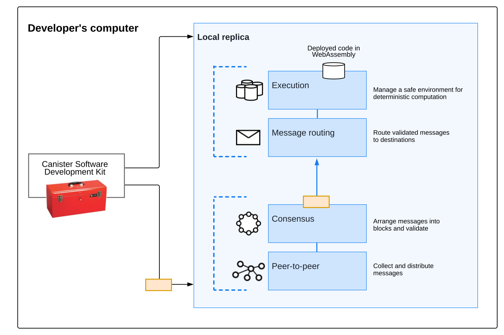

# 节点和子网

`IC`子网提供物理硬件和资源————`CPU`和内存，来执行软件操作。每一个子网都是有数台去中心化的、独立控制的、互相连接的电脑组成；其中互联的每一台电脑都称作节点（`node`）。节点运行者遵循`ICP`协议的套件。

这个套件叫做`replica`，因为`replica`会在当前的子网复制状态和计算并遍布整个子网。

`replica`的核心组件被组织成以下逻辑层：

- 点对点的网络层：从用户、其子网中的其它节点以及其它子网收集和发布消息。对等层接收到的消息被复制到子网中的所有节点，以确保安全性、可靠性和弹性。
- 共识层：选择和排序从用户到不同子网收到的消息，以创建区块链块，这些区块可以通过拜占庭容错共识进行公证和最终确定，从而形成不断发展的区块链。这些最终确定的块被传递到消息路由层。
- 消息路由层：在子网之间路由用户和系统生成的消息，管理`dapp`的输入和输出队列，并安排消息的执行。
- 执行层：通过处理从消息路由层接收到的消息来计算执行智能合约所涉及的确定性计算。

下图提供了在开发环境中部署为本地罐头执行环境的`ICP`组件的简化概述：

作为开发者，了解你的`dapp`和用户与`dapp`的交互如何通过`IC`架构路由或者在`IC`上复制的详细情况不是必要的。但是，对关键组件的一般理解可能会很有用，因为开发环境包括副本组件，以提供用于部署的 {EE} 和对生产部署工作流的真实感。